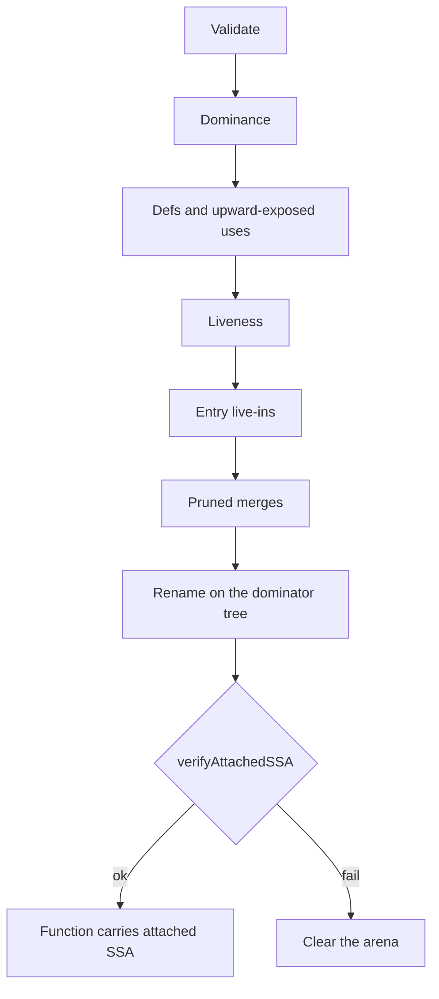
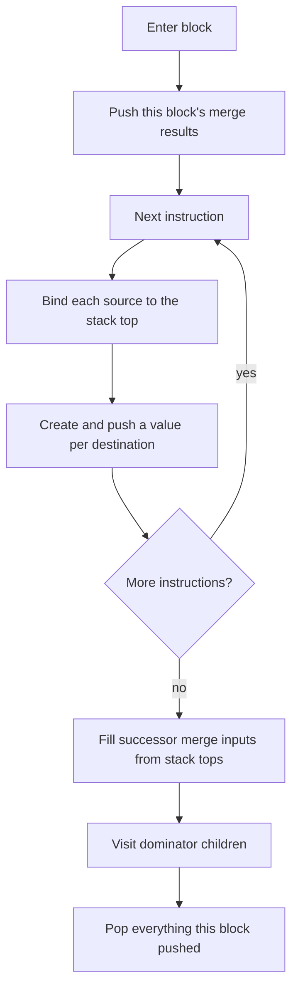

# Lift Asm registers to SSA pass

`LiftAsmRegistersToSSAPass` converts a function's physical register operands into SSA and attaches the result directly to the IR (`SSAArena`, instruction `AttachedSSA`, and block arguments).

Allocation and destruction both read that attached state; SSA never lives beside the program as a separate graph.

It supports VGPR and SGPR operands and is available through `stinkytofu-opt`.
A backend that runs register allocation uses it too; section 12 of [register allocation](register-allocation.md) covers the ordering that has to hold.

## 1. Purpose

Register allocation needs to know that one physical register written twice holds two unrelated values.
The existing `buildUseDefChain()` and the pseudo PHIs it places cannot express that: they are keyed by physical `RegKey`, so they give the scheduler and wait-count insertion the reaching-definition edges those passes need, but they never rename a definition.

This pass supplies the missing value identity.
It is the boundary between the existing physical-register Asm pipeline and anything that reasons about values rather than registers.

The pass converts the final optimized and scheduled physical-register dataflow into attached SSA:

```text
physical non-SSA Asm IR
  -> LiftAsmRegistersToSSAPass
  -> physical instructions plus attached SSA metadata on Function/blocks/instructions
  -> liveness, pressure, and register allocation
  -> SSA destruction and physical rewrite
```

The pass does not require TensileLite to produce virtual registers.
A physical register such as `v8` is treated as the name of mutable storage before the pass.
Each reaching definition of `v8` becomes a distinct SSA value.

```text
v8 = op_a()
use(v8)
v8 = op_b()
use(v8)

        |
        v

%1 {legacy=v8} = op_a()
use(%1)
%2 {legacy=v8} = op_b()
use(%2)
```

## 2. What lifting produces

Lifting writes the attached SSA types: `StinkySSAValue`s in a `Function`-owned `SSAArena`, `AttachedSSA` on each instruction, and `SSABlockArgument`s on blocks.
[Attached SSA on StinkyTofu Asm IR](ssa-representation.md) is the contract for those types; this document covers only how the pass builds them.

`StinkyRegister` stays the copyable physical spelling in `srcRegs` / `destRegs` and is not an SSA value, so lifting adds identity beside the operands rather than replacing them.
A function with no attached SSA is still valid pre-lift IR.

## 3. Pass name and public API

Use:

```text
C++ pass name: LiftAsmRegistersToSSAPass
Factory:        createLiftAsmRegistersToSSAPass()
Display name:   Lift Asm Registers to SSA
IR output:      Attached SSA on Function / BasicBlock / StinkyInstruction
stinkytofu-opt: LiftAsmRegistersToSSAPass[=classes=vs,strictLiveIns,noVerify]
```

Legacy analysis caching is not used.
Consumers read attached SSA from IR state (`Function::hasAttachedSSA()`, `Function::ssaArena()`, block arguments, and instruction `AttachedSSA`).

Construction and the pass factory live on the pass header:

```cpp
// include/stinkytofu/transforms/asm/ssa/LiftAsmRegistersToSSAPass.hpp
namespace stinkytofu {

struct LiftAsmRegistersToSSAOptions {
    RegClassSet classes = RegClassSet::all();
    bool verify = true;
    bool allowInferredLiveIns = true;
};

struct LiftAttachedSSAResult {
    size_t valueCount = 0;
    size_t blockArgumentCount = 0;
};

STINKYTOFU_EXPORT Expected<LiftAttachedSSAResult> liftAsmRegistersToAttachedSSA(
    Function& function,
    const LiftAsmRegistersToSSAOptions& options = {});

STINKYTOFU_EXPORT Expected<LiftAttachedSSAResult> liftAsmRegistersToAttachedSSA(
    Function& function,
    const DominanceInfo& dominance,
    const LiftAsmRegistersToSSAOptions& options = {});

// Whole-kernel preflight; see section 4.1.
STINKYTOFU_EXPORT bool kernelHasCallSites(
    const std::vector<const Function*>& functions);

STINKYTOFU_EXPORT std::unique_ptr<Pass>
createLiftAsmRegistersToSSAPass(
    const LiftAsmRegistersToSSAOptions& options = {});

}  // namespace stinkytofu
```

The pass uses `liftAsmRegistersToAttachedSSA(...)`, which clears and rebuilds attached SSA on the function.
Failure is a recoverable error rather than a pass-level abort: a caller receives either a fully attached and verified function, or the reason there is no SSA.

### 3.1. Lift scope

`classes` selects which register classes become SSA values.
Everything outside it stays physical: those operands carry an immediate payload, contribute no value slot, and SSA destruction never rewrites them.
That is how a caller allocates one class while leaving the others exactly as the producer wrote them — lifting SGPRs alone leaves every VGPR untouched, and with it the VGPR high-water mark and its kernel metadata.

Capability and scope are different questions, and the pass keeps them apart.
A class outside `kLiftableRegClasses` is an error, because lifting cannot model it soundly; narrowing the scope does not widen that set.
A class inside the capability but outside the scope is skipped, exactly like a literal.
Narrowing to nothing is rejected rather than treated as a no-op.

The scope is recorded as `SSAArena::liftedClasses()`, and `liftedSSAUnits(reg, classes)` takes it as a required argument, because the slot layout depends on it and every walker must agree.
The shape fingerprint cannot stand in: it hashes the physical program, which is identical whichever classes were lifted, so two scopes over one program share a shape while numbering their values differently.
`AllocationResult` carries the scope for that reason, and destruction rejects a colouring computed under a different one.

Diagnostics are located as `@function #instruction operand: message`, for example:

```text
@kernel #1 src0: register class 'a' is not lifted yet; VGPRs and SGPRs are supported
```

The implementation follows the existing pass convention:

```cpp
class LiftAsmRegistersToSSAPassImpl : public Pass {
  public:
    static char ID;

    const char* getName() const override {
        return "Lift Asm Registers to SSA";
    }

    PassID getPassID() const override {
        return &LiftAsmRegistersToSSAPassImpl::ID;
    }

    PreservedAnalyses run(Function&, PassContext&, AnalysisManager&) override;
};
```

Lifting is function-wide, not a `StinkyInstPass`.
Partial basic-block filtering is invalid because PHI placement and renaming require the complete CFG.
If `PassContext::shouldProcessBasicBlock()` excludes any block, the pass records that as the reason there is no attached SSA; it never constructs partial SSA.

## 4. Input contract

The pass requires:

1. a complete per-function CFG with stable predecessor order;
2. final scheduled instruction order;
3. only physical allocatable operands; template registers carrying `StinkyRegister::kVirtualBit` are rejected;
4. complete explicit source and destination register operands;
5. instruction metadata for tied and read-modify-write operands;
6. no `GFX::PHI` instructions left in the stream, whatever placed them;
7. no stale instruction-level `sources` or `users` graph that a later pass expects to remain valid.

Register classes are recognised from the operands themselves, through `isAllocatableReg()` and `isPseudoReg()`.
No target register description is consulted, so fixed, reserved, and alignment-constrained registers are invisible to the pass; the [attached SSA contract](ssa-representation.md) section 6.1 covers what that costs, and section 14 below lists what is in scope and what is refused.

### 4.1. Function calls and `FlattenCalleesPass`

A call is not a CFG edge to its callee: the caller falls through, callable functions are separate `Function`s, and `CallTargetData` records only possible callee names.
That is enough to keep function boundaries and build a call graph, and not enough to allocate across a call, because nothing records which registers a call passes, returns, clobbers, or preserves.
Those choices are currently implicit in TensileLite's physical allocation.

`FlattenCalleesPass` does not help.
It moves callable bodies to their assembly placement markers and empties the callable functions, but leaves the call instructions and their `CallTargetData` intact, so lifting afterwards would lose the per-function ownership while still lacking call effects.

Until a target-owned calling convention exists, the rules are:

1. run `LiftAsmRegistersToSSAPass` per function, before `FlattenCalleesPass`;
2. reject an `isCall()` instruction rather than guessing its effects;
3. fall back to legacy physical allocation for a whole call-connected kernel, never recolouring one side of a call.

`kernelHasCallSites()` is what rule 3 is built on: it preflights a whole kernel, so one call anywhere keeps the entire call-connected kernel on the legacy path.
When the convention does arrive it needs argument, result, clobber, and preserved-register sets; interprocedural SSA does not, because each function keeps its own arena and a value live across a call only has to land in a preserved register or be spilled.

## 5. Output contract

On success, attached SSA is present on the Function (`SSAArena`, block arguments, and instruction `AttachedSSA`).
Physical `srcRegs` / `destRegs` are unchanged.
"In scope" below means an allocatable class the lifter supports and `options.classes` selected.
The attached form satisfies:

- every in-scope source unit maps to exactly one SSA value;
- every in-scope destination unit defines a new SSA value;
- the arena records the scope it was built for, so the operand walk is reproducible;
- every SSA value has exactly one definition: an instruction result, or the block argument it is;
- merge points contain block arguments where required;
- block-argument incoming operands model predecessor-edge uses;
- all uses have exact instruction, operand, and unit positions;
- every value records its original physical binding;
- tuple grouping, tied operands, and operand order are recoverable from the bindings, as the [attached SSA contract](ssa-representation.md) section 6.1 describes; alignment is not, because nothing models it yet;
- IDs and printed output are deterministic.

The pass does not:

- select new physical registers;
- mutate physical source or destination operands;
- emit `GFX::PHI` instructions;
- lower PHIs to copies;
- compute interference or color registers;
- update kernel resource metadata.

## 6. Storage keys

Before lifting, one mutable variable is one physical register unit:

```cpp
struct RegKey {
    RegType type;
    unsigned idx;
    RegHalf half;
};
```

`RegKey` is the lifter's internal storage key, and `PhysicalBinding` is the legacy-colouring provenance it becomes.
Neither is an SSA value identity: one key has as many values as it has reaching definitions, which is the entire reason attached SSA exists.

Today `half` is always `RegHalf::NONE`, and the lifter expands an operand with `toRegKey(reg, unit)` for `unit` in `[0, reg.num)`, so every unit is a whole DWORD.
That is correct because a True16 half *write* is rejected: a half read occupies the DWORD it selects from rather than half of one, so the expansion only needs every definition to be DWORD-wide.

The rest of this subsection is future work.
Before supporting True16, introduce one authoritative allocator operand-expansion helper using the architecture rules already encoded by `VGPRHalfKeyer` in `RegHalfKeyer.hpp`:

```cpp
void forEachAllocatorRegUnit(
    const StinkyInstruction& instruction,
    OperandRole role,
    unsigned operandIndex,
    function_ref<void(RegKey)> callback);
```

This helper must account for operand width, register class, implicit allocatable operands, architecture-dependent D16 collapsing, and `RegHalf` metadata.
It must not infer a True16 half from `StinkyRegister::reg.offset`.

Do not directly treat every producer/consumer key emitted by `VGPRHalfKeyer` as an independent SSA variable: `RegHalf::NONE` aliases both halves on a per-half architecture.
Normalize to non-overlapping atomic units.
A full-DWORD write defines LOW and HIGH and a full-DWORD read consumes both; on a target that collapses D16 writes, use one full-DWORD unit instead.

## 7. Initial-value policy

Physical input does not carry the producer identity needed to distinguish every kernel live-in from an accidental use-before-definition.
The pass must make this limitation explicit.

The policy is:

1. A supported allocatable register read without a reaching definition becomes an inferred live-in: an entry block argument with no incoming edge. This is the default, and it is what makes the corpus liftable at all.
2. Strict mode, selected by clearing `allowInferredLiveIns`, rejects the function instead, naming the first instruction that reads the key.
3. Never silently substitute literal zero for a value with no definition.

There is no separate "undefined" value kind.
Lifting either finds a reaching definition or creates a live-in, so nothing needs one, and adding a kind that nothing produces would only be a case every consumer has to handle.
There is likewise no source of declared entry live-ins: ABI and kernel-entry metadata would let strict mode become the default, and would let allocation stop treating every inferred live-in as interfering with everything before its first definition.

Conservative inferred live-ins preserve the semantics of the original physical program, at the cost of that extra interference.

## 8. Construction algorithm

Cytron construction: iterated dominance-frontier merges, then dominator-tree renaming.
Merges are block arguments, not `GFX::PHI` instructions.
Any failure leaves attached SSA empty.



**Validate / dominance.** Reject the cases in sections 4 and 14.
`RemoveDefUseAnalysisPass` must already have run: leftover `GFX::PHI` is an error, not a repair.
Dominance is `computeDominanceInfo(Function&)`; callers that already hold it pass it in.

**Defs, uses, liveness.** Walk in deterministic order and expand operands to `RegKey`s.
Each block records only keys it writes (`defs`) and keys it reads before writing (`upwardExposed`).
Sources are processed before destinations so a tied or read-modify-write instruction sees its incoming value.

```text
liveIn[B]  = upwardExposed[B] + (liveOut[B] - defs[B])
liveOut[B] = union of liveIn[successors]
```

`liveIn[entry]` is the live-in set (section 7).
Liveness also decides where a merge is worth placing.

**Pruned merges.** For each key, take the iterated dominance frontier of its definition blocks, including the entry if that key has a live-in.
Place a merge only where the key is live at the block entry, so no dead merge is created.
No `GFX::PHI` instruction is inserted.

**Rename.** One stack of current values per `RegKey`.
Entry live-ins are pushed once; then each block:



A use is recorded in the same step as the bind, which is what keeps the two directions in the [SSA representation](ssa-representation.md) section 4.7 in agreement.
The walk is an explicit stack, because a long straight-line kernel has a dominator tree as deep as its block count.
A duplicate predecessor edge fills every matching slot.

Read-modify-write is bind-then-define on that stack:

```text
v40 = wmma(..., v40)
v40 = wmma(..., v40)

        |
        v

%acc1 {legacy=v40} = wmma(..., %acc0)
%acc2 {legacy=v40} = wmma(..., %acc1)
```

Results, operands, and block-argument incoming uses are written during this walk.
`verifyAttachedSSA` then runs unless `verify` is cleared.

## 9. Block argument example

A worked diamond, showing both kinds of block argument.
This is the real `tests/filecheck/lift_asm_registers_to_ssa_diamond.stir` input:

```text
st.func @lift_asm_registers_to_ssa_diamond() {
^entry:
  v9 = "st.v_add_f32"(v20, v21)
  SCC0 = "st.v_cmp_eq_u32"(v10, v11)
  "st.s_cbranch_scc1"("right", SCC0)
  Successors: ^left, ^right
^left:
  v5 = "st.v_add_f32"(v22, v23)
  "st.s_branch"("join")
  Successors: ^join
^right:
  v5 = "st.v_add_f32"(v24, v25)
  Successors: ^join
^join:
  v6 = "st.v_add_f32"(v5, v9)
}
```

and the SSA it lifts to, as `ssaForm` prints it (see the [attached SSA contract](ssa-representation.md) section 10.1):

```text
st.func @lift_asm_registers_to_ssa_diamond() {
  ^entry(%1:v, %2:v, %3:v, %4:v, %5:v, %6:v, %7:v, %8:v):
    %10:v = "st.v_add_f32"(%3:v, %4:v) { issueCycles = 1, latencyCycles = 5 }
    SCC0 = "st.v_cmp_eq_u32"(%1:v, %2:v) { issueCycles = 1, latencyCycles = 5 }
    "st.s_cbranch_scc1"(right, SCC0) { issueCycles = 1, latencyCycles = 1 }
    Successors: ^left, ^right
  ^left:
    %12:v = "st.v_add_f32"(%5:v, %6:v) { issueCycles = 1, latencyCycles = 5 }
    "st.s_branch"(join) { issueCycles = 1, latencyCycles = 1 }
    Successors: ^join
  ^right:
    %11:v = "st.v_add_f32"(%7:v, %8:v) { issueCycles = 1, latencyCycles = 5 }
    Successors: ^join
  ^join(%9:v):
    %9:v = phi(^left: %12:v, ^right: %11:v)
    %13:v = "st.v_add_f32"(%9:v, %10:v) { issueCycles = 1, latencyCycles = 5 }
}
```

`^entry` takes **eight arguments and no `phi` lines**.
Those are the live-ins: `v10`, `v11`, `v20`–`v25` are read before anything writes them, so their values arrive from outside the function, with no edge to merge on.
They are sorted by register key, which is why `%1`/`%2` are `v10`/`v11` even though `v20`/`v21` are read first.

`^join` takes **one argument with a `phi` line**.
`v5` is written on both arms, so the join needs a merge; `v9` is written only in `^entry`, which dominates the join, so it needs none and `%10` is read directly.
`^left` and `^right` take no arguments at all — nothing merges there.

Three further things this example shows:

- `%9`, `%11`, and `%12` all keep `v5` as their `PhysicalBinding`. That is what lets the producer's colouring put the program back byte-identically, and what makes the merge need no copy: every version colours back to the same register.
- `SCC0` stays physical in both forms. SCC is not an allocatable class, so the compare's destination binds no value, and neither do the branch's label and condition operands.
- No `GFX::PHI` appears anywhere. The merge is on the block, so the instruction stream is exactly the physical one, which is why lifting can be undone.

The incoming uses live on the `^left -> ^join` and `^right -> ^join` edges, not at the top of `^join`.
That is why the block owns them rather than an instruction: there is no instruction at the point where the value is consumed.
The `phi` line is a rendering of those edges, printed in predecessor order for readability.

## 10. Relationship to current PHI and def-use code

Reusable:

- `RegKey`, `RegKeyHash`, and full-DWORD range expansion;
- `computeDominanceInfo()`;
- iterated dominance-frontier concepts from `PhiPlacement.cpp`;
- dominator-inherited reaching-definition concepts from `BuildDefUseChain.cpp`;
- `PhiTestFixtures.hpp` CFG fixtures.

Not reusable as SSA value identity:

- `StinkyInstruction::sources` and `users`, because they identify instructions rather than exact SSA values and use sites;
- physical `GFX::PHI` instructions, because they allow null/literal-zero incoming state and are def-use analysis artifacts;
- `RegKey` as value identity, because one key can have many definitions;
- one-RPO reaching-definition state without dominator stack renaming.

The pass shares the generic dominance and cleanup helpers, but keeps its own data model and verifier.

## 11. Verification

`verifyAttachedSSA()` is the in-memory checker, and the lifter runs it before returning unless the `verify` option is cleared.
What it checks, and what it deliberately leaves to construction, is in [Attached SSA on StinkyTofu Asm IR](ssa-representation.md) section 10.

## 12. The round-trip gate

Every value keeps the register it was lifted from as its `PhysicalBinding`, so all versions of `v8` colour back to `v8`.
Lowering that colouring therefore has to reproduce the input program exactly:

```text
LiftAsmRegistersToSSAPass -> legacy colouring -> SSA destruction
```

Byte-identical assembly and metadata across that round trip is the lift pass's own correctness gate, run as `RegisterAllocationPass` with the `legacy` policy and `apply`.
Identity alone is a weak test, since a lowering that did nothing would also pass, so a uniformly shifted colouring is tested alongside: every value moves by a constant, and the program must come back with every register renumbered and nothing else changed.

Consumers on the other side of lift are documented in the [SSA representation](ssa-representation.md) contract: the mutation APIs an SSA rewrite uses are section 8, and the destruction contract is section 5.3.
Allocation policy is not this pass's concern; the framework that consumes what it produces is documented in [register allocation](register-allocation.md), and the default policy in [the greedy allocator](register-allocation-GreedyAllocator.md).

## 13. Analysis invalidation

Lifting mutates attached SSA on the function, so it returns `preserveCFGAnalyses()`: CFG analyses stay valid, but analyses keyed by instruction/operand dataflow are not preserved.

`RemoveDefUseAnalysisPass` returns `preserveCFGAnalyses()`.
It removes instructions but leaves blocks and edges alone, and it invalidates:

- physical instruction def-use chains;
- physical PHI/reaching-definition analyses;
- register liveness and pressure analyses;
- any analysis keyed by instruction operands or order.

`PreservedAnalyses` preserves nothing by default.
Attached SSA is IR state, so it is not evicted by the analysis manager; a later pass that mutates operands must either preserve the meaning of those values or clear/rebuild SSA.

SSA destruction returns `preserveCFGAnalyses()` after rewriting operands and clearing attached SSA.

Mutating the CFG, instruction order, or register operands makes attached SSA stale.
Destruction refuses to lower when the shape fingerprint no longer matches.

## 14. Scope and limitations

Supported:

```text
register classes    VGPR and SGPR, full DWORD
operands            scalar, multi-DWORD ranges, overlapping and disjoint
                    ranges, partial redefinition, read-modify-write
control flow        straight line, diamonds, loops, self-loops, nested loops,
                    irreducible CFGs, duplicate predecessor edges
lowering            legacy colouring back to the original registers
```

Covering SGPRs is safe because VCC and EXEC are their own register types in this IR rather than SGPR indices, so a scalar operand can never alias a special register at the `RegKey` level.

Rejected, each with a located diagnostic rather than a silent mishandling:

```text
accumulator classes  an AGPR and a VGPR can name the same storage on some
                     architectures, so two values over one register would be
                     unsound; needs target register information
True16 half writes   the destination preserves the other half, so it reads the
                     DWORD it writes, and that read has no operand to bind yet.
                     Half *reads* are lifted, as reads of the whole DWORD
unreachable blocks   dominance is undefined there; run
                     StinkyUnreachableBlockElimPass after CFG construction
entry loop headers   a live-in reaching a loop header has no predecessor edge
                     to merge on; needs a distinct preheader
call sites           need a calling convention describing argument, result,
                     and clobbered registers
leftover GFX::PHI    RemoveDefUseAnalysisPass must discard it first; lift
                     rejects it rather than repairing it
template virtuals    must be resolved to physical registers before lifting
```

Ignored rather than lifted, because they are not allocatable: literals, special registers such as EXEC, VCC, SCC, and M0, and pseudo registers including memory and barrier tokens.
They bind no SSA units and stay visible only in the physical operands.

Not modelled at all, and therefore not safe to infer from attached SSA: operand alignment, precoloured ABI registers, and reserved ranges.
Anything reasoning about those needs target register information, which does not exist yet.
They constrain allocation rather than lifting, which never chooses a register.

Two consequences worth stating plainly.
A value with no SSA uses is not necessarily dead, because special-register writes and memory effects are outside attached SSA.
And SSA destruction rejects any colouring that would need a copy on a merge edge, since copy insertion, parallel-copy sequencing, and critical-edge splitting are not implemented.

## 15. Complexity

Let:

- `N` be basic blocks;
- `E` be CFG edges;
- `R` be distinct physical register units;
- `I` be instructions plus expanded operand units;
- `F` be total dominance-frontier size.

Expected cost:

```text
dominance       O(N * E) with the current implementation
PHI placement   O(R * (N + F)) worst case
renaming        O(I + PHI incoming edges)
verification    O(I + SSA values + PHI incoming edges)
```

Use dense SSA IDs and vectors on hot paths.
Use `RegKeyMap` for sparse pre-lifting storage state.
