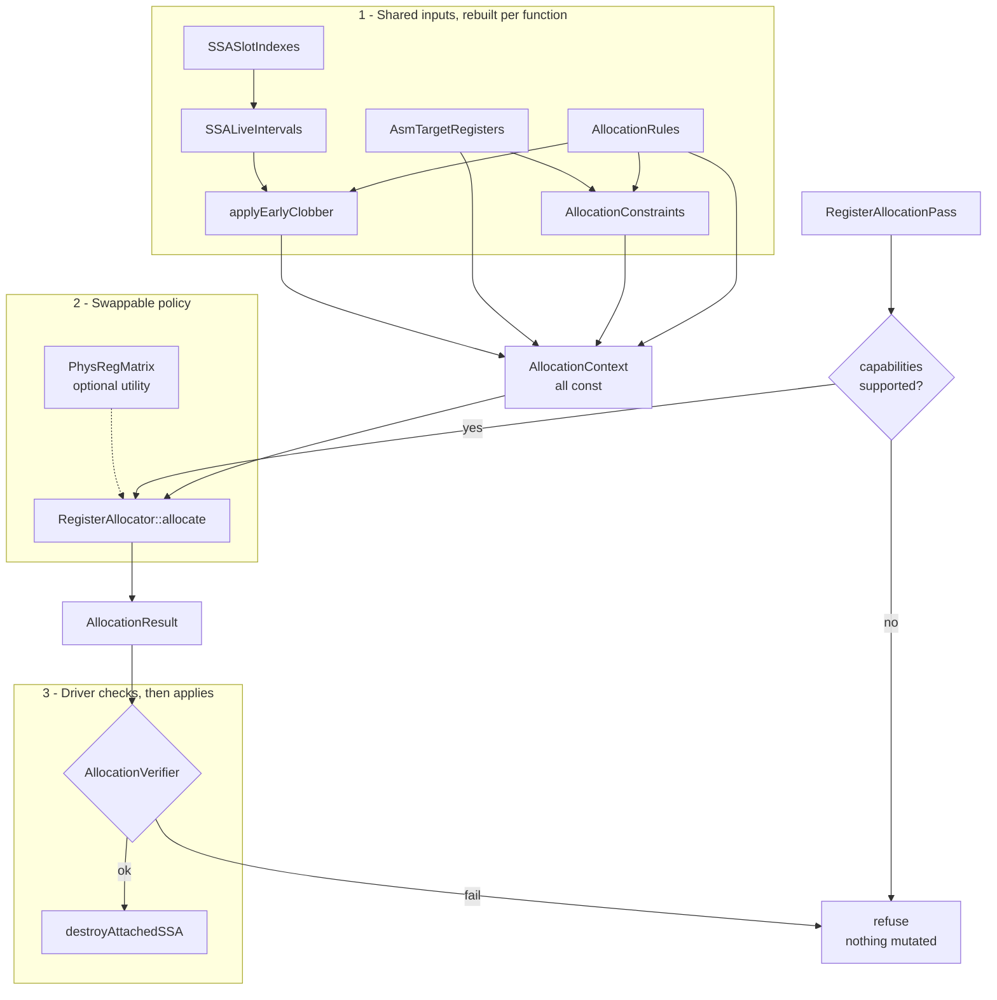
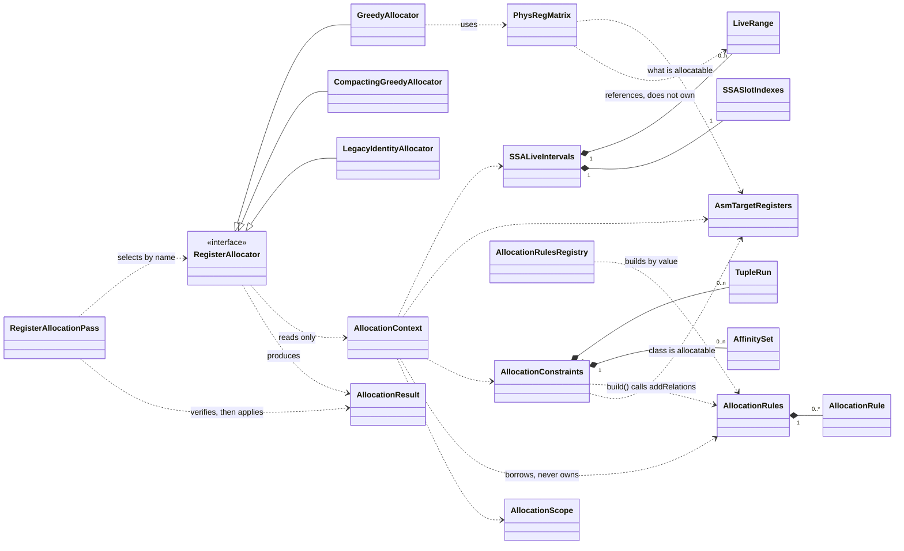
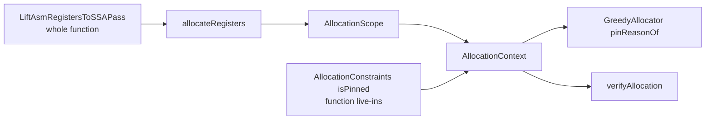
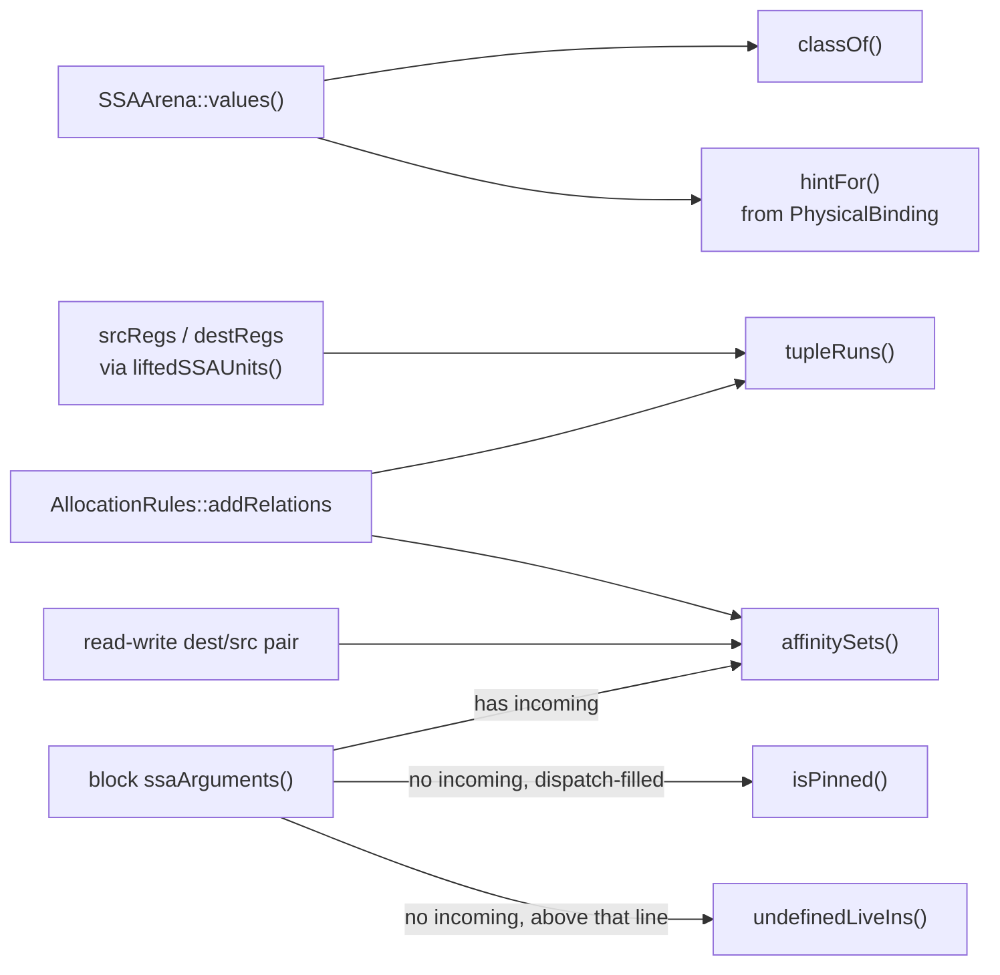
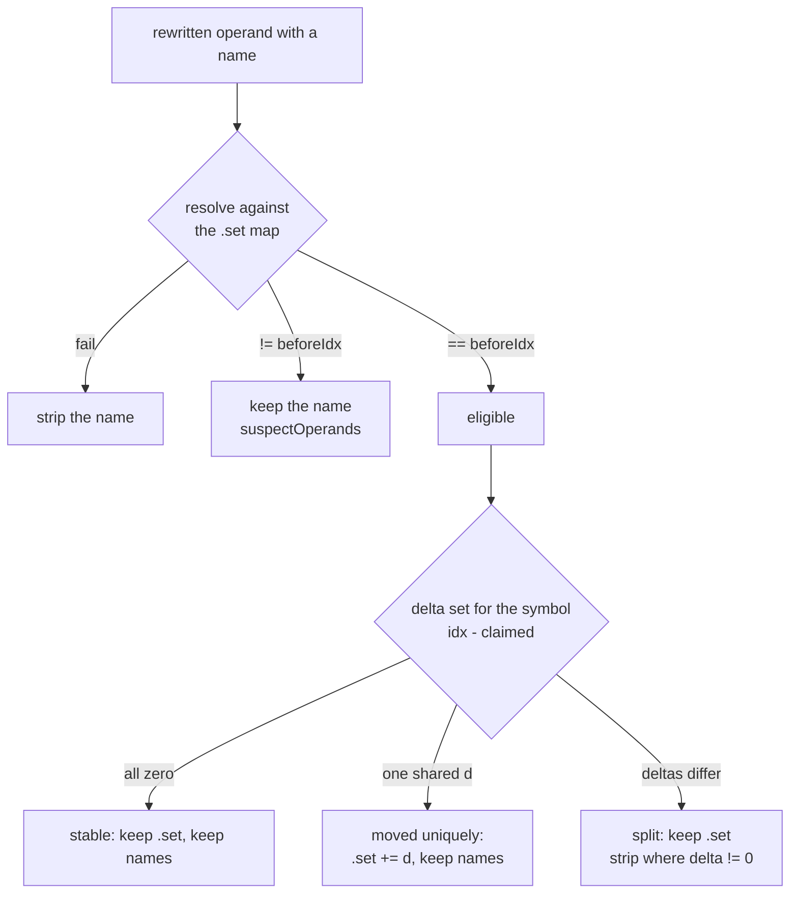
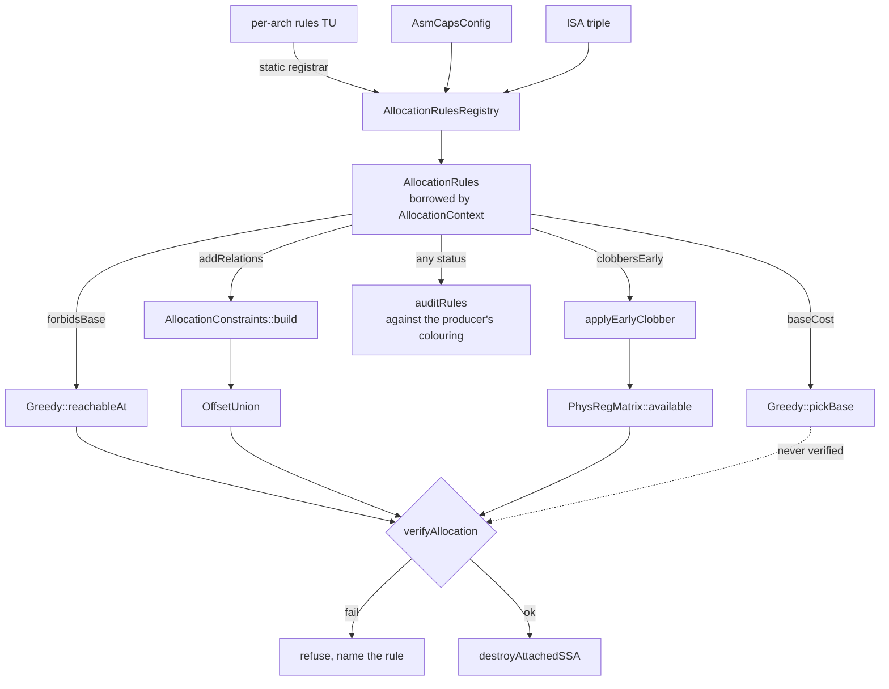

# Register allocation on attached SSA

How a colouring policy plugs in, what it may read, and what it must not touch.

- [SSA representation](ssa-representation.md) — values, use-lists, block arguments, `AllocationResult`, `destroyAttachedSSA`
- [Lift Asm registers to SSA](lift-asm-registers-to-ssa-pass.md) — how physical `RegKey`s become those values
- [The greedy allocator](register-allocation-GreedyAllocator.md) — `greedy` and `greedy-compact`, including how they honour placement and preference rules
- [Adding an architecture](adding-architecture.md) — a new triple's rules TU lives beside the pipeline, not inside it

## 1. The contract

Take a function carrying attached SSA, return an `AllocationResult`: every `StinkySSAValue` mapped to a physical `RegKey`.

Two terms recur throughout and mean one thing each:

| Term | Meaning |
|---|---|
| **the producer** | Whatever emitted the input assembly: TensileLite, through rocisa. Unusually for a compiler input, it has already assigned every physical register by hand. |
| **the producer's colouring** | Those original registers. Lifting records each one on its value as a `PhysicalBinding`, and `createLegacyColoring()` is the colouring that hands every value straight back the register the producer chose. |

The registers an input arrives with are therefore variable names and placement hints, not a final assignment — `hintFor()` offers them to a policy, which is free to place a value elsewhere.

Three rules hold for every policy.

| Rule | Consequence |
|---|---|
| `destroyAttachedSSA` is the only writer of `srcRegs` / `destRegs` | a policy never touches an operand, `setPhysicalBinding`, or a use-list |
| A refused colouring changes nothing | operands and attached SSA are left exactly as the lifter produced them |
| Every value must be assigned | a class a policy will not *move* is pinned to its original register, not skipped |

The third rule is easy to miss and shapes everything else: the verifier and destruction both demand a *total* colouring, so "leave this class alone" is expressed by assigning it the register it already had.

## 2. Framework

The policy is one replaceable object; everything around it is shared. A new policy is a class plus a registration line.



Two refusal points, and the driver owns both. A policy that never runs and a colouring that is rejected leave identical IR behind.

```cpp
/// Everything an allocator may read. Const on purpose: no allocator mutates IR.
struct AllocationContext {
    const Function& function;
    const SSALiveIntervals& intervals;
    const AsmTargetRegisters& target;
    const AllocationConstraints& constraints;
    const std::vector<Loop>& loops;
    const AllocationRules& rules;    // chip facts; a policy queries, never names a chip
    AllocationScope scope;           // classes and optional slot prefix this run may move
};

/// What lowering must support for this allocator's output to be applicable.
struct AllocatorCapabilities {
    bool mayRecolourMerges = false;  // needs copy insertion on merge edges
    bool maySpill = false;           // needs scratch and waitcnt integration
};

class RegisterAllocator {
   public:
    virtual const char* name() const = 0;
    virtual AllocatorCapabilities capabilities() const = 0;
    virtual Expected<AllocationResult> allocate(const AllocationContext&) = 0;
};
```

Everything but `function` is rebuilt on each call, in this order — `constraints` keeps a reference to `target` and `build()` also takes the rules table, so the order is not free:

| Field | Built by |
|---|---|
| `rules` | `AllocationRulesRegistry::forArch(triple, caps)`, then `force(overrides)` |
| `intervals` | `computeSSALiveIntervals(function)` — the program's own ranges, what the shadow report reads |
| `target` | `AsmTargetRegisters::forFunction(function)` |
| `constraints` | `AllocationConstraints::build(function, target, rules)` |
| `loops` | `detectLoops(function)` |
| allocator / verifier intervals | `applyEarlyClobber(function, intervals, rules)` — identical until a `clobbersEarly` rule is Active |
| `scope` | `AllocationScope::wholeFunction`, or `upTo` when `regionEnd` is set, over the allocator intervals |

A policy decides two things: which value to colour next, and which candidate to take when the first is occupied. It does not derive legality from operands, does not verify, and does not apply. It also never learns which chip it is running on: it queries `context.rules`, and that is what keeps every present and future policy subject to whatever table applies. Section 14 is the rules themselves.

| Responsibility | Owner | Varies with |
|---|---|---|
| program points, live ranges | `SSASlotIndexes`, `SSALiveIntervals` | program |
| which registers exist and may be handed out | `AsmTargetRegisters` | chip |
| which placements and sharings are illegal, and which are merely worse | `AllocationRules` | chip, plus module caps |
| tuple runs, merge affinity, hints, pinning, read-write ties | `AllocationConstraints` | program |
| who occupies a register over which range | `PhysRegMatrix` (a utility, not part of the interface) | colouring |
| candidate choice and ordering | the policy | policy |
| capability gate, verification, application | `RegisterAllocationPass` / `allocateRegisters` | — |

`AllocatorCapabilities` is the seam that stops a policy producing a colouring lowering cannot apply. `destroyAttachedSSA` rejects a merge whose inputs and result differ, and nothing implements spilling, so both flags must be false to be applicable.

How the types relate — solid is ownership, dashed is a reference:



`AllocationRules` owns its rows by value, so a table is copyable and an unregistered triple is an empty table rather than null. `AllocationContext` borrows it. There is no edge from a rule to any allocator, to `PhysRegMatrix`, or to the verifier: a rule describes, it never participates in search.

`AllocationContext` reaches only the shared side, so a policy cannot see the IR it must not mutate.

Where all of it lives, under both `include/stinkytofu/` and `src/`:

| Directory | Contents |
|---|---|
| `ir/asm/ssa/` | the SSA data model, plus `AllocationResult`, the colouring a policy returns |
| `ir/asm/` | `SymbolicRegName` (the name grammar) and `AsmSetSymbolMap` (`.set` collection), both read by symbol sync in section 11.1 |
| `analysis/asm/ssa/` | `SSASlotIndexes`, `SSALiveIntervals`, `computeFunctionShape` |
| `transforms/asm/ra/` | this pass, the allocator registry, the verifier, `AllocationConstraints`, `AllocationRules`, `AllocationScope`, `PhysRegMatrix`, `RegisterSymbolSync`, `createLegacyColoring`, and the policies under `allocators/` — those are private to `src/`, since selection is by name |
| `transforms/asm/ra/target/` | one rules TU per ISA triple, pulled in by that directory's `CMakeLists.txt`. Pipeline composition stays in `src/pipeline/backend/` |
| `transforms/asm/ssa/` | the lift pass and `destroyAttachedSSA`, the two ends of the SSA lifetime |

### 2.1. Selection

`AllocatorRegistry` maps a name to a factory, mirroring `BackendRegistry` including the `registerAllAllocators()` guard against dead-stripping in static builds. One pass serves every policy, and `stinkytofu-opt` exposes the options as a comma-separated list:

```text
--RegisterAllocationPass=allocator=greedy-compact,classes=v,regionEnd=C,apply,report
```

| Option | Meaning |
|---|---|
| `allocator=<name>` | `greedy` (default), `greedy-compact`, `legacy` |
| `classes=<vs>` | class axis of allocation scope; see section 3 |
| `regionEnd=<label>` | region axis: only values whose live range ends at or before this block may move (`^` prefix optional). Empty = whole function. See section 3.2 |
| `apply` | write the colouring through `destroyAttachedSSA`; without it the pass is a shadow colouring |
| `report` | emit peak / highest / `regionPeak` as an analysis remark (`--remarks`) |
| `emitRegisterMap` | with `apply`, insert a producer→allocated map as a TEXTBLOCK at the entry block; see section 11.3 |
| `emitSymbolBreadcrumbs` | with `apply`, note on each instruction whose operand lost a symbolic name; see section 11.3 |
| `noVerify` | skip the verifier — a testing hatch, not a production switch |
| `rules=<name>` | force this architecture rule `Active`, ignoring the chip's capability gate. Repeat the key (`rules=A,rules=B`) or join with `+` (`rules=A+B`) — a comma already separates pass arguments |
| `rules=all` | force every rule the triple declares |
| `ruleAudit` | force every hard rule to `Audit` |
| `noRules` | empty the table: the pre-framework behaviour |

A misspelled rule name is an error, not a silent no-op. Section 14 covers the table itself.

Conformance tests are parameterized over `registeredAllocatorNames()`, so registering a policy is what subscribes it to the suite.

## 3. Scope: what a run may relocate

Three answers, two of them on `AllocationScope` (this run's remit) and one on the
arena (what even exists as SSA). Remit is not folded into `isPinned()`: that
accessor is legality — a colourer that ignores it produces wrong code rather than
a slower kernel.

| | Lift | Allocation, class | Allocation, region | Allocation, held registers |
|---|---|---|---|---|
| Where | `SSAArena::liftedClasses()` | `AllocationScope::classes()` | `AllocationScope::regionCut()` | `AllocationScope::isPinnedRegister()` |
| Question | which classes became SSA values | which lifted classes may *move* | which of those values may *move* | which registers keep what they hold |
| Outside it | no values, never rewritten | original register | original register | original register |
| Set by | `LiftAsmRegistersToSSAOptions::classes` | `RegisterAllocationOptions::allocate` | `RegisterAllocationOptions::regionEnd` | `RegisterAllocationOptions::pinRegisters` |

Holding names registers rather than values, and has two halves: the value lifted
into a held register keeps it, and no other value may be placed there. Both are
needed — a held register is free wherever its occupant is dead, so freezing only
the occupant would still let scratch move in. It is deliberately not
`AsmTargetRegisters::reserve()`, which withholds a register from everyone and so
rejects the value already in it, a live-in most of all.

Bounds are inclusive, reading like the `s[6:26]` the IR prints:
`{{RegType::S, 24, 26}}` holds s24 through s26. `GreedyAllocator` asks from
`reachableAt`, so placement, eviction and hint-following all inherit it, and
`verifyAllocation` rechecks it independently.



Three reasons a value cannot move, in the order greedy reports them:

| Reason string | Source | Kind |
|---|---|---|
| `a function live-in` | `AllocationConstraints::isPinned()` | legality |
| `in a class this run is not colouring` | class axis of `AllocationScope` | remit |
| `outside the region this run is colouring` | region axis of `AllocationScope` | remit |

Pinned / immobile blocks are placed first and are never evictable. The verifier
checks both pin and scope, then still binds the occupant so a mobile value
overlapping that register is caught.

### 3.1. Class

Narrow the lift when a class should be invisible — cheaper, and nothing about it
is analysed. Narrow allocation when a class should be *measured but not moved*:
lift both classes and colour one, and the other's intervals and peak pressure
are still available.

The allocation set must be a subset of the lift, so a request for a class with
no values is reported rather than silently colouring nothing:

```text
@kernel: asked to allocate v but this function was lifted for s
```

The default is VGPRs alone. No ABI range is reserved, and scalar allocation
is still an explicit opt-in even when a placement rule forbids some bases
(section 14.5):

```bash
--LiftAsmRegistersToSSAPass=classes=s \
--RegisterAllocationPass=allocator=greedy,classes=s,apply
```

### 3.2. Region

Lift the whole function, then relocate only values whose live range lies in a
slot prefix ending at a named block. The remainder keeps the producer's
registers. No copy insertion, no partial lift.

Because section 4 numbers the function in block-list order, a prefix of the
block list *is* a prefix of the slot space, and the region is one integer:

```text
entry → A → B → C → D → E
[--------- region R --------][-- remainder --]
                             cut = blockEnd(C)
```

`cut` is `intervals.slots().blockEnd(endBlock)`. The pass uses `ContainedIn`;
`DefinedIn` exists on `AllocationScope::upTo` for tests and custom drivers only.

| Containment | Test | Used by |
|---|---|---|
| `ContainedIn` (default) | `rangeOf(id).end() <= cut` | `RegisterAllocationPass` when `regionEnd` is set |
| `DefinedIn` | `rangeOf(id).start() < cut` | `AllocationScope::upTo(..., DefinedIn)` only |

| Value | Live range vs cut | Result |
|---|---|---|
| defined and used only in `R` | `end() <= cut` | may move |
| defined in `C`, used in `D` | range crosses the cut | immobile; `D` stays byte-identical |
| defined in `D` or `E` | range starts after the cut | immobile, but does not overlap `R`, so `R` may reuse those registers |
| live across a backedge `E → B` | range extends past the cut | immobile — no CFG-closure check needed |

No `s_mov` / `v_mov`. Every use is an SSA use, so `destroyAttachedSSA` rewrites
them consistently. A physical/SSA seam never exists inside the function.

`greedy` follows hints and reproduces the input, so a region is a no-op.
`legacy` assigns every hint. **`greedy-compact` is the policy that relocates.**

`regionPeak` is pressure over `[0, cut)`. `highest` still walks every assigned
value, including pinned tail values, so compacting `R` cannot lower the kernel's
declared count unless the function peak is inside `R`.

`PassContext` block filtering still refuses ("skip this block"): allocation
needs a total colouring. Region scope means *colour everything, relocate only
these*.

Not a partial lift, not copy insertion, not an occupancy tool unless
`regionPeak` shows the peak is inside `R`. `pinRegisters` perturbs the whole
colouring; `regionEnd` shrinks the movable set monotonically.

### 3.3. Use

```bash
# VGPRs whose live range ends at or before ^C; D and E stay as written.
stinkytofu-opt kernel.stir \
  --LiftAsmRegistersToSSAPass=classes=v \
  --RegisterAllocationPass=allocator=greedy-compact,classes=v,regionEnd=C,apply,report \
  --DumpStinkyModulePass=stdout \
  --remarks
```

```bash
# Same for SGPRs. Lift and allocate must name the same class.
stinkytofu-opt kernel.stir \
  --LiftAsmRegistersToSSAPass=classes=s \
  --RegisterAllocationPass=allocator=greedy-compact,classes=s,regionEnd=C,apply
```

`regionEnd=^C` and `regionEnd=C` are equivalent. Pick the label from a dump
(`^label:` lines). An unknown label refuses: `region end block 'X' was not found`.

```cpp
pm.addPass(createRegisterAllocationPass(RegisterAllocationOptions{
    .allocator = "greedy-compact",
    .allocate = RegClassSet::only(RegType::S),
    .regionEnd = "C",
    .applyToOperands = true,
    .report = true,
}));
```

A production pipeline that opts in via `ModuleOptions::RegisterAllocation`
(TensileLite's `StinkyTofuRegisterAllocation`) lifts and colours SGPRs:
0 off, 1 shadow, 2 apply. The backend runs `greedy-compact` over the whole
function after schedule and waitcnt. SSA / before / after dumps stay commented
so a multi-kernel build does not overwrite a single fixed path. When reproducing
one kernel, uncomment them:

| File | What to check |
|---|---|
| `<module>_kernel_ssa.stir` | SSA form; pick `regionEnd` from `^label:` |
| `ssa_live_out.txt` | live ranges and function peak |
| `kernel_before_replay.stir` | physical IR before colouring |
| `kernel_after_replay.stir` | physical IR after `apply` |

Diff before vs after: blocks after the cut must be identical; blocks in the
region may change under `greedy-compact`. A miss names the reason (unknown
label, class mismatch, or `no s register is free for ...`).

```bash
./build/tests/unit_tests --gtest_filter="AllocationScopeTest.*:GreedyAllocatorTest.RegionScopeKeepsTailBlocksByteIdentical:RegisterAllocationPassTest.RefusesAnUnknownRegionEndBlock:RegisterAllocationPassTest.ShadowReportIncludesRegionPeak"
```

| Test | Asserts |
|---|---|
| `AllocationScopeTest.*` | class vs region, `ContainedIn` vs `DefinedIn`, backedge extends past the cut |
| `AllocationVerifierTest.CatchesARelocatedValueOutsideRegion` | region remit is machine-checked |
| `GreedyAllocatorTest.RegionScopeKeepsTailBlocksByteIdentical` | `entry→A→B→C→D→E`, `D`/`E` byte-identical, a region-only value compacted |
| `RegisterAllocationPassTest.RefusesAnUnknownRegionEndBlock` | missing label is an error |
| `RegisterAllocationPassTest.ShadowReportIncludesRegionPeak` | report contains `regionPeak=` |

## 4. Coordinates: slot indexes

`computeSSASlotIndexes()` numbers the function in block-list order, which is emission order. Each instruction gets **two** consecutive indexes; each block a leading pair.

| Index | Meaning |
|---|---|
| `blockStart(B)` | a value live into `B` starts here |
| `blockStart(B) + 1` | `B`'s arguments are defined here (`blockArgDef`) |
| `useSlot(I)` | `I` reads its operands |
| `useSlot(I) + 1` | `I` writes its results (`defSlot`) |
| `blockEnd(B)` | one past `B`'s last index |

Blocks tile the space with no gaps, so layout-adjacent blocks are numerically adjacent. Block `B` with two instructions, then `C` with one:

```text
        block B                     block C
slot    0u  1d │ 2u  3d │ 4u  5d ││ 6u  7d │ 8u  9d
        args   │   I0   │   I1   ││ args   │   I2
```

A dump tags each index with the half it names: `u` for the read point, `d` for the write point. The letter is a *position*, not a claim about a value — `d` does not mean "defined here". LLVM does the same with four sub-slots per instruction (`B`, `e`, `r`, `d`) where this has two.

Ranges are half-open, which gives two rules:

- a value defined by `I` starts at `I`'s `d` point;
- a value last read by `I` ends at `I`'s `d` point, so it is still live at `I`'s `u` point where the read happens.

**Why two slots per instruction matter.** At `v40 = wmma(..., v40)` the old value ends at the `d` point and the new one starts there: they touch without overlapping, so both can live in `v40`. Collapse the pair into one index and they would overlap, no policy could share the register, and even the identity colouring would fail verification.

No policy queries slot indexes directly; they are the coordinate system intervals are expressed in.

An early-clobber destination starts at the `u` point instead of the `d` point, so it overlaps sources dying at that instruction. That widening is not this numbering: `applyEarlyClobber` derives a second interval set for the allocator and the verifier (section 14.4). The dump and the shadow report still read the unwidened ranges.

## 5. Live intervals

`computeSSALiveIntervals()` produces ranges over `StinkySSAValue`, which is what decides whether two values may share a register. A `LiveRange` is a sorted list of half-open segments.

| Query | Use |
|---|---|
| `rangeOf(id)` | the value's live range |
| `overlap(a, b)` | may `a` and `b` share a register |
| `LiveRange::length()` | denominator of a spill weight |
| `peakPressure(class)` | pressure floor per class |

Where a value's range starts:

- `Kind::Register`: at `defSlot(defOp())`; each entry in `uses()` is a read at `useSlot(owner())`.
- `Kind::BlockArgument`: at `blockArgDef()` of its block. Incoming values are consumed on the predecessor **edge** — live to the end of that predecessor, not inside the join — which is why a merge and its inputs can share one register.

```text
liveOut[B] = union of liveIn[successors] + values used on B's outgoing edges
liveIn[B]  = uses in B whose def is elsewhere + (liveOut[B] - defs in B)
```

A range is a *set* of segments rather than one span, because a value can be dead across a region and live again after it.

### 5.1. Worked example

`tests/filecheck/lift_asm_registers_to_ssa_diamond.stir`, dumped by `DumpStinkyModulePass` with `ssaLiveOut` set:

```text
^entry:  v9 = v_add_f32(v20, v21)      Successors: ^left, ^right
^left:   v5 = v_add_f32(v22, v23)      Successors: ^join
^right:  v5 = v_add_f32(v24, v25)      Successors: ^join
^join:   v6 = v_add_f32(v5, v9)
```

```text
slots=22 values=13
%1:v [1d,5d)     %2:v [1d,5d)     %3:v [1d,3d)     %4:v [1d,3d)
%5:v [1d,11d)    %6:v [1d,11d)    %7:v [1d,8u) [14u,17d)
%8:v [1d,8u) [14u,17d)            %9:v [19d,21d)   %10:v [3d,21d)
%11:v [17d,18u)  %12:v [11d,14u)  %13:v [21d,22u)
peak v=8
```

Four things to read off it:

| Observation | Why |
|---|---|
| `%3 [1d,3d)` is `v20` | born as an entry argument at 1, killed by the add that reads it at 2 |
| `%10 [3d,21d)` is `v9` | defined at 3, not read until the join at 20, so live across the diamond |
| `%7`, `%8` have a **hole** | `v24`/`v25` are read only by `^right`, but `^left` sits between in layout order; one span would hold two registers across a block that needs neither |
| `%9`, `%11`, `%12` never overlap | the merge starts at `19d`, each incoming ends at its own arm's end, so one register holds all three and no copy is needed |

`peak v=8` is measured at slot 1, where all eight live-ins are live at once.

Peak pressure comes off the same segments, so there is no separate pressure analysis. It is a *lower bound*: it ignores tuple fragmentation, so a peak of 40 DWORDs can still fail if 4-DWORD operands do not fit the free runs. It is also not occupancy — `getWavesPerSimd()` takes the final allocated count.

`SSALiveIntervalsAnalysis` caches the result and is deliberately absent from `preserveCFGAnalyses()`: reordering instructions or rewriting operands invalidates intervals even when the CFG is untouched.

## 6. Interference: the physreg matrix

`PhysRegMatrix` records which live ranges occupy each allocatable unit `(RegType, idx)`. Interference is asked of a *register*, not of a pair of values, so no interference graph exists.

Each unit holds a **list** of bindings, which is what lets several values share one register:

```text
class          index      bindings: value + range (borrowed from SSALiveIntervals)
V ──────────▶  v0    ──▶  (empty)
               v1    ──▶  %12 [11d,14u)   %31 [17d,21d)   ← disjoint, both legal here
               v2    ──▶  %7  [1d,8u) [14u,17d)
S ──────────▶  s0    ──▶  %40 [3d,9d)
```

Construction takes the class set from `target.allocatableClasses()` and sizes each class to `indexCount(class)`, so a class the target allows can never be silently skipped.

| Query | Purpose |
|---|---|
| `available(class, idx, range)` | allocatable, and nothing bound there is live where `range` is |
| `collectConflicts(class, idx, range, out)` | *who* the conflict is with — what an evicting policy needs |
| `runAvailable(class, base, width, range)` | every unit of `[base, base+width)` is free, and the run stays inside the class |
| `findFreeRun(class, width, range)` | lowest such base, scanning up from 0. First-fit, no alignment applied |
| `bind` / `unbind` | `unbind` is silent when the value does not hold the unit, so undoing a partial tuple needs no bookkeeping |
| `highestBound(class)` | the width a resource descriptor cares about, which is not the peak pressure |

`available()` is the whole legality test, and it is three checks:

1. the target calls `(class, idx)` allocatable — this is also what excludes reserved ranges;
2. the class has storage and `idx` is inside it;
3. no binding already on that unit has a range overlapping the candidate's.

Two consequences of the borrowed ranges. `SSALiveIntervals` must outlive the matrix, and `bind` deletes its rvalue overload, so passing a temporary range is a compile error rather than a dangling pointer — the query methods take temporaries safely, since they only read during the call.

Only allocatable classes have storage. EXEC, VCC, SCC, M0, literals, and memtokens are not values and never occupy a unit; VCC and EXEC are their own `RegType`, so colouring SGPRs cannot alias them by index.

The matrix is a utility rather than part of the interface: a linear-scan or graph-colouring policy may want a different structure and should not pay for this one.

When a `clobbersEarly` rule is Active, the allocator and the verifier see the widened ranges from `applyEarlyClobber`, so `available()` refuses the reuse the rule forbids without the matrix knowing what a rule is.

## 7. Target registers

`AsmTargetRegisters` answers which registers may be handed out. It sits beside `ArchHelper` rather than under `analysis/`, because it derives nothing from the IR — it is architecture description. Every limit comes from the architecture's own `DEF_ARCH` block in `hardware/src/gfx/<Arch>/<Arch>Formats.def`:

| Field | Meaning |
|---|---|
| `.maxVGPR`, `.maxSGPR`, `.maxAGPR` | indexes an operand can encode → `indexCount(class)` |
| `.totalVgprPerSimd` | physical register file → `totalPerSimd(class)` |
| `.vgprAllocGranule` | step occupancy is measured in → `allocationGranule(class)` |

Nothing is keyed on an architecture, so supporting a target means editing that target's `.def`.

**`indexCount()` and `totalPerSimd()` are different numbers.** The first is what an operand can encode; the second is the physical file, which can be several times larger. Reaching the rest of that file needs high-register encoding, which is not modelled, so a kernel whose pressure exceeds the addressable range has no colouring here.

`forFunction()` reads `SSAArena::liftedClasses()`, so allocatable classes are exactly the lifted ones — a class the lifter cannot model and a class this lift left physical are both excluded. `allocatableClasses()` enumerates the set once, so a consumer cannot restate a shorter list and silently skip a class.

`reservedRanges()` starts empty. Which registers late passes and each ABI mode hold back is not encoded, so a caller that knows calls `reserve(class, first, count)` rather than reading a guess.

## 8. Constraints the colourer reads

`AllocationConstraints::build()` walks the function once. A policy reads the result; it never repeats the walk, so tuple and merge rules cannot drift between policies.

> `AllocationConstraints` is a function of the *program*.
> `AllocationRules` is a function of the *chip*.

Falsifiable: run one `.stir` through two architectures and the constraints are identical while the table differs; run two functions through one architecture and the constraints differ while the table is the same and could be built once per module. Not merged because the storage disagrees — constraints are dense per-value vectors rebuilt per function, a table is a handful of rows valid for a whole module.

They touch at one point, one-way: `addRelations` appends to the constraints during `build()`. Otherwise they compose without referencing each other. An alignment rule meets the program only in the candidate loop — constraints contributing that two values form a width-2 block, the table contributing that such a block may not start odd.

Four sources, five products from the program, plus whatever Active offset rules append:



Everything is stored per value ID, so every query is an array lookup. Only `isAllocatable()` defers to the target at query time, which is what makes a later `reserve()` visible.

| Constraint | Source | Rule |
|---|---|---|
| Consecutive range | operand + `liftedSSAUnits()` | `tupleRuns()`: one operand's slots occupy consecutive units, in operand order |
| Merge | `SSABlockArgument.incoming` | `affinitySets()`: the argument and every incoming value get one colour |
| Pinned | block argument with no incoming, in a register the dispatch fills | `isPinned()`: must keep its original register |
| Hint | `PhysicalBinding` | `hintFor()`: first candidate, not an obligation |
| Class | `StinkySSAValue::type()` | `classOf()` / `isAllocatable()` |
| Tied / RMW | overlapping bindings on a src and a dest, or `isReadWrite` | may share a unit; `collectReadWriteTies` adds an `AffinitySet` so they must |
| Ignored specials | not lifted | never in the matrix |
| Alignment | chip, via `forbidsBase` | not a constraint; see section 14.5 |

Three things deliberately yield no constraint, which is as useful to know:

- a one-unit operand — a run needs two or more units, so single-DWORD operands are free;
- an affinity set that collapses to one member after sort and dedup, so a merge already agreeing with its incoming value adds nothing;
- a reserved hint — `isAllocatable()` is class-level and never consults `hintFor()`, so a value whose original register is reserved stays a candidate that simply cannot keep its hint.

**Read-write operands must share a colour.** `s_cmov_b32 d, s` is `if (SCC) d = s`: on the untaken path `d` keeps what it already held. `HwInstDesc` marks that field `isReadWrite` and `AsmVerifierPass` already requires the register in both `destRegs` and `srcRegs`. The IR models the old value as an extra implicit source that the assembler does not print. Overlapping bindings *permit* sharing; `collectReadWriteTies` adds an `AffinitySet` per pair so the colourer *must* keep them together — the same mechanism as a merge. `tests/filecheck/allocation_read_write_tie.stir` uses an untied input so the colouring has to bring the two together rather than merely preserve them.

**Pinning is legality, not policy.** A block argument with no incoming edges is a function live-in: its value arrives in a specific register that the dispatch filled before any instruction ran, so nothing in the function defines it and relocating it changes what the kernel reads. A policy that ignores `isPinned()` emits wrong code, not a slower kernel. A placement rule that forbids that register has no repair: the kernel comes out uncoloured.

**But only up to where the dispatch stops writing.** "No incoming edge" says nothing defines the value; the pin claims something *else* does, and that holds only inside the ABI prefix — `settledDispatchFilledSgprCount()`: preloaded kernargs plus two for the kernarg segment pointer, then one per enabled workgroup id, so 32 for a kernel with `.amdhsa_user_sgpr_count 29`. A scalar live-in above that line was written by nobody, so any register serves it equally and a pin there preserves contents that do not exist — at `s[100:107]` on a 106-register chip it cannot be honoured at all, which is why an SGPR-heavy kernel came back uncoloured. Those values stay movable and are listed in `undefinedLiveIns()`, which the shadow report names: "nothing defines it" and "it is undefined" differ by whether lifting saw every definition, so a run that moves one should be able to say which.

Every unknown pins. The line arrives as `kSigDispatchFilledSgprsMetaKey` on the Function, the descriptor not being reachable from a pass, and absent or zero reads as the whole file — so a `.stir` file or a test keeps the old behaviour. A kernel with no preloaded kernargs never publishes it at all, the descriptor leaving it unsettled whether the kernarg segment pointer sits in `s[0:1]` ahead of the workgroup ids; understating the line is the one direction that produces wrong code. Vector live-ins stay pinned regardless, the workitem ids being packed in a layout this does not model.

**Alignment is a placement rule, not a constraint.** Neither `AllocationConstraints` nor `destroyAttachedSSA` checks it — both check consecutiveness alone. A row such as `ScalarTupleAlignment` forbids a bad base through `forbidsBase`, and the verifier rechecks it, so a policy that ignores the table is refused rather than assembled. A chip with an empty table still does not enforce alignment. Do not route an arch preference through `hintFor()`: that is the register the producer used, so it would vanish for any value with no hint.

Partial redefinition is already separate values, so no extra constraint is needed:

```text
v[20:27] = old
v[20:21] = ds_load_b64(...)     %new20, %new21 are new values
consume(v[20:27])               %old22..%old27 keep their reaching values
```

They constrain each other only when they appear together in one operand.

## 9. The shipped policies

| Name | Class | Summary |
|---|---|---|
| `greedy` | `GreedyAllocator` | weighted first-fit with eviction, preferring each value's original register. The default |
| `greedy-compact` | `CompactingGreedyAllocator` | the same, with hints off, so placement packs from the bottom |
| `legacy` | `LegacyIdentityAllocator` | hands every value straight back the producer's register, via `createLegacyColoring()` |

All three report empty `AllocatorCapabilities`, so none is refused by the gate in section 2.

[The greedy allocator](register-allocation-GreedyAllocator.md) covers the two greedy policies in full: how tuple runs and affinity sets fold into placeable blocks, how weight is computed, the eviction rule and why it terminates, why hint-following reproduces the input, and how `reachableAt` / `pickBase` honour the rules table.

## 10. Verifier

`verifyAllocation(function, result, context)` is independent of the colourer and runs on every result, including the identity colouring:

- `result.shape()` matches the arena, and the function has not changed since it was lifted
- every value is assigned a full-DWORD register of its own class
- that register is allocatable and not reserved
- a pinned value, and a value with a non-null `immobileReason`, keep their lifted register
- no two overlapping intervals share a unit
- every `tupleRuns()` entry is consecutive in operand order
- every `affinitySets()` entry shares one colour
- a value that leads a tuple run (or a singleton) sits at a base no Active `forbidsBase` rule rejects; interior members of a run are skipped, because the rule constrains the run's start, not each lane

Failure names the `valueId`, class, interval, and conflicting occupant, and a placement miss names the rule: `rule <Name>: <description>`. Because it runs on the identity colouring too, live intervals are computed even for a policy that only copies `PhysicalBinding`. The verifier reconstructs run width from `tupleRuns()` rather than from greedy's `OffsetUnion`, so a block formed only by an affinity set spanning different widths is checked per member — conservative, not exact (section 14.7).

**The verifier is deliberately stricter than destruction, never looser.** Whatever it accepts, `destroyAttachedSSA` can lower — that one-directional guarantee is what makes `apply` safe, since a colouring cannot get past review and then fail at the last step. It requires the two check sets to stay aligned, so both reject a stale program shape *and* a colouring built under a different lift scope: two lifts of one program share a shape, because the shape hashes physical operands, but they number their values differently.

The identity colouring is not automatically legal. A producer that used a register outside the encodable range fails the allocatable check, since high-register encoding is not modelled:

```text
@kernel: %1 is assigned v300, which is not allocatable
```

That is the verifier being stricter than the raw lowering path underneath it. `destroyAttachedSSA` will happily write `v300` back, because it is putting back exactly what was there, so a kernel the producer wrote that way is still lowerable — reachable as `noVerify`, which is the only way past this check.

Overlap is checked against the same `SSALiveIntervals` the allocator used, so an error in that analysis makes policy and verifier wrong together and silent. Reaching definitions over STIR dumps keep a stable SSA identity across a rewrite; comparing them per *register* between two assemblies does not, because a register hosts a different set of values afterwards.

## 11. Applying a colouring

`applyToOperands` calls `destroyAttachedSSA` once the verifier passes. Only then does anything reach the operands, and only the register class and base index of each operand change: widths, modifiers, symbolic names, and the instruction stream are all preserved. Destruction plans every rewrite before performing any, so a rejection leaves the function exactly as the lifter produced it, attached SSA included.

Preserving the symbolic name is deliberate — some operands carry nothing else — but it is also why applying a colouring takes a second step. A preserved name and a rewritten index can now disagree, and the emitter believes the name. Section 11.1 is that step.

That contract is checked one kernel at a time: `register_allocation_legacy_identity.stir` and `register_allocation_sgpr_only.stir` re-print a coloured kernel through FileCheck, and the unit tests in `tests/unit/ra` drive each refusal path directly. There is no corpus-wide sweep.

When a kernel comes out uncoloured, the reason is one of these, which is more useful to know than a pass rate:

| Reason | Meaning |
|---|---|
| `no attached SSA` | the lift refused the function, so allocation never ran |
| `pinned live-in unplaceable` | a live-in's register is reserved or not encodable |
| `register not encodable` | the producer used a register past `indexCount` |
| `no free register` | pressure exceeds the class, and there is no splitting or spilling |
| `tuple not consecutive` / `affinity split` | a policy broke a constraint the verifier enforces |
| `rule <Name>: <description>` | an Active placement or interference rule rejected the colouring |
| `capability refused` | the policy needs copy insertion or spilling |
| `scope mismatch` | the allocation class set is not a subset of the lift, or `regionEnd` names no block |
| `outside the region` | greedy-compact could not place a region value around the pinned remainder |

Comparing two policies on the same input is what the report in section 12.1 is for: it prints the pressure and high-water mark a colouring implies without applying it.

### 11.1. Symbolic names and the `.set` block

`StinkyRegister` carries two independent identities: a numeric one (`reg.idx`) and an optional name (`literalValue`). Nothing links the name to the `.set` directive that gives it a value — the producer simply writes the two consistently. Production emits with `useSymbolicNames = true`, and that path prints the name and **never prints `idx`**.

Rewriting `idx` alone is therefore not enough. A reallocated operand still prints the producer's name, the assembler resolves the producer's `.set`, and the colouring is silently discarded for that operand. It is not a mislabelled register; it is the wrong register.

Take this input, with the live-ins pinned and the temp moved to `s18` by `greedy-compact`:

```text
.set sgprWorkGroup0, 0
.set sgprTmp, 7
s_mul_i32  s[sgprTmp],        s[sgprWorkGroup1], s[sgprNumWorkGroups0]
s_sub_u32  s[sgprWorkGroup0], s[sgprWorkGroup0], s[sgprTmp]
```

| Operand | `idx` after apply | Printed | Assembler binds |
|---|---|---|---|
| `s[sgprTmp]`, dest of the mul | 18 | `s[sgprTmp]` | **s7** — wrong |
| `s[sgprWorkGroup0]`, src of the sub | 0 | `s[sgprWorkGroup0]` | s0 — correct, pinned |
| `s[sgprWorkGroup0]`, dest of the sub | 18 | `s[sgprWorkGroup0]` | **s0** — wrong |

Two different failures. `sgprTmp` moved wholesale, so its `.set` is merely out of date. `sgprWorkGroup0` **split**: one name would have to mean both `s0` and `s18`, which no single `.set` can express.

**Turning names off is not the fix.** Four combinations of (name valid) × (`idx` valid) all occur in real input:

| | `idx` | name | Where from | Correct emit |
|---|---|---|---|---|
| Q1 | valid | agrees | untouched operands, `greedy` | either |
| Q2 | valid | **stale** | operands this run moved | **numeric** |
| Q3 | **placeholder `0`** | valid | `makeSymbolicSgpr("sgprGSU")` | **symbolic** |
| Q4 | valid | malformed | legalization regex on a shape it does not handle | numeric |

Q2 and Q3 want opposite global settings: `makeSymbolicSgpr` builds `RegType::S, idx = 0` and puts the truth in the name, so `useSymbolicNames = false` would print those operands as `s0`. The repair has to be per operand, in the IR.

> **The invariant.** A register operand may keep its symbolic name only if the name's base symbol resolves to some `v` with `operand.idx == v + sum(offset terms)`. Otherwise the name is cleared and the operand prints numerically.
>
> **Exemption.** An operand this run did not rewrite is left exactly as the producer wrote it. That is what keeps Q3 printable.

`syncRegisterSymbols` restores the invariant, and runs only after a successful apply — no `apply`, no rewrite list, no sync:

```cpp
if (options.applyToOperands) {
    const SSADestructionResult destroyed = destroyAttachedSSA(function, *allocated);
    if (!destroyed.ok()) return Expected<AllocationResult>::Error(destroyed.toString());

    SymbolSyncOptions syncOptions;
    syncOptions.emitRegisterMap = options.emitRegisterMap;
    syncOptions.emitBreadcrumbs = options.emitSymbolBreadcrumbs;
    syncRegisterSymbols(function, destroyed.rewritten, syncOptions);
}
```

There is no window between `destroyAttachedSSA` and `clearAttachedSSA` — the clear is internal — so sync cannot read SSA. It reads `SSADestructionResult::rewritten`, the list destruction already built privately and now publishes:

```cpp
struct RewrittenOperand {
    StinkyInstruction* instruction = nullptr;
    bool isDestination = false;
    size_t operand = 0;
    RegType beforeType = RegType::UNKNOWN;
    uint32_t beforeIdx = 0;
    RegType afterType = RegType::UNKNOWN;
    uint32_t afterIdx = 0;
};
```

Both identities are load-bearing: `beforeIdx` says where the name used to be right, `afterIdx` says where the operand is now. A rejected destruction returns the list empty, so a refusal cannot half-strip a function.

`legacy` and `greedy` with `apply` still run sync. Every named use is still at its `.set` value, so every symbol classifies as stable and the assembly is byte-identical. `greedy-compact` is the policy that actually moves names.

### 11.2. How a symbol is classified

A name is only as good as the `.set` it resolves against, so sync reads both first. `collectAsmSetSymbolInfo` walks every block — Tensile does not keep its `.set` directives in the entry block — and records how many times each symbol is defined. A symbol defined twice is unresolvable, even though the flat map still holds the last value. `parseSymbolicRegName` handles the five shapes that appear in `literalValue`:

| Shape | Example | Resolves to |
|---|---|---|
| bare | `sgprGSU` | `v` |
| single offset | `vgprValuA_X0_I0+4` | `v + 4` |
| multi offset | `vgprFoo+1+2` | `v + 1 + 2` |
| negative / MSB | `vgprSerial-512` | `v - 512` |
| explicit range | `vgprFoo+0:vgprFoo+3` | start; `regNum` must match the operand width |

Anything that does not parse, or whose base is missing from the map, is unresolvable and loses its name.

**Per operand.** For each rewritten operand that still carries a name, resolve the name and compare against **`beforeIdx`** — where the operand was, not where it now is:

| Resolution vs `beforeIdx` | Meaning | Action |
|---|---|---|
| resolves, equal | an ordinary named operand | **eligible** to vote on its symbol |
| resolves, differs | name and index never agreed: a Q3 placeholder, or corruption | **keep the name**, record in `suspectOperands` |
| does not resolve | no usable `.set` | **strip** |

The middle row is what keeps `s[sgprGSU]` with `idx = 0` intact even if a scalar run does rewrite it.

**Per symbol.** One `.set` legitimately names several registers: `.set sgprSrdD, 20` covers `s[sgprSrdD+0]` at `s20` and `s[sgprSrdD+1]` at `s21`. Classifying on the raw index set would call that a split and strip `+1`, because `21 != 20`. So the decision is made on the **delta** between where an operand sits and where its own name claims it sits:

```text
delta = idx - resolveNamedIndex(fullName, setMap, regNum)
```

Offsets are part of the claim, so every member of an untouched tuple has delta `0`, and moving a tuple shifts every member by the *same* delta. That is exactly what makes one `.set` rewrite sufficient for a whole group.

| Case | Eligible deltas | `.set` | Eligible names |
|---|---|---|---|
| **stable** | all `0` | keep | keep |
| **moved uniquely** | all equal to one `d != 0` | rewrite to `old + d` | keep |
| **split** | two or more distinct | keep `old` | **strip** where `delta != 0` |
| **unresolvable** | base missing from the map, or defined more than once | keep | **strip** eligible uses |
| **out of scope** | no register operand names it (immediates, macros) | keep | n/a |



Only rewritten operands are ever stripped, and only rewritten operands vote. In practice every named operand in a lifted class is rewritten, identity or not, so a live-in that stayed put votes with delta `0`; the genuinely non-voting operands are those outside the lifted classes, and a symbol whose uses are all outside the lift is left completely alone. A region run (section 3.2) is the same story one level down: the immobile remainder is never rewritten, so nothing there is stripped and nothing there votes.

Two properties make this safe. Stripping is never wrong for a rewritten operand, because `idx` is the allocator's own output and the numeric form says exactly that. And rewriting a `.set` is only an optimisation so that ABI names survive compaction — every moved-uniquely case could legally have been handled as a split.

Applied to the example from section 11.1, with an `sgprSrdD` pair added to show the offset case:

| Symbol | Eligible uses | Deltas | Case | Result |
|---|---|---|---|---|
| `sgprWorkGroup1` | none, outside the lift | n/a | exempt | `.set` and name unchanged |
| `sgprTmp` | dest and src, both at 18, claiming 7 | `{+11}` | moved uniquely | `.set sgprTmp, 18`, names kept |
| `sgprWorkGroup0` | src at 0, dest at 18, both claiming 0 | `{0, +18}` | split | `.set` stays 0, the dest loses its name |
| `sgprSrdD` | `+0` at 20, `+1` at 21, claiming 20 and 21 | `{0}` | stable | `.set` stays 20, both names kept |

```text
.set sgprWorkGroup0, 0
.set sgprTmp, 18
.set sgprSrdD, 20
s_mul_i32  s[sgprTmp],        s[sgprWorkGroup1], s[sgprNumWorkGroups0]
s_sub_u32  s18,               s[sgprWorkGroup0], s[sgprTmp]
s_add_u32  s[sgprSrdD+0],     s[sgprSrdD+0],     s[sgprTmp]
s_addc_u32 s[sgprSrdD+1],     s[sgprSrdD+1],     0
```

Mutating an already-linked `.set` in place is new — no earlier transform did it — and the write walks every block for the same reason the collection does.

### 11.3. Debug output

Two mechanisms, both off by default, both gated at construction through `RegisterAllocationOptions`:

| Option | Effect |
|---|---|
| `emitRegisterMap` | one TEXTBLOCK at the front of the entry block |
| `emitSymbolBreadcrumbs` | a trailing `//` note on each instruction that lost a name |

The register map is attached to no instruction. The emitter writes TEXTBLOCK payloads verbatim and does not consult `emitComments`, so it exists only when asked for:

```text
// register-map: producer -> allocated
// sgprTmp  7 -> 18  moved, .set rewritten
// sgprWorkGroup0  0 -> 0, 18  SPLIT, name kept where it still resolves
```

This is the only artifact that can express a split, one name against several numbers. `ScopeAdaptor` erases TEXTBLOCK on its preserve path, so it is not a data channel between passes.

Breadcrumbs answer the opposite question — what *was* this operand:

```text
v_add_f32    v0, v[vgprSrd+0], v2   // v0 was vgprSrd+0 (split)
s_mul_i32    s1, s0, s4             // s1 was sgprTmp (unresolved .set), s0 was sgprWorkGroup0 (unresolved .set)
ds_load_b128 v[20:23], v1           // v[20:23] was vgprValuA+0:vgprValuA+3 (unresolved .set)
```

Every other outcome is legible in the assembly on its own: a kept name is visible, a rewritten `.set` is visible. A stripped operand is the one case that prints as a bare number with nothing recording that it was ever named, which is what makes the note worth turning on when reading a before/after diff, and why it stays off otherwise.

| Detail | Why |
|---|---|
| the reason in parentheses | `split` means the allocator moved one use of a shared name and the numeric operand is correct; `unresolved .set` means sync never saw the binding, so the directive is outside the processed region or defined more than once. Opposite remedies, so the note has to distinguish them |
| the whole register range | a 4-DWORD operand reads `v[20:23] was ...`, matching what the emitter prints beside it rather than naming only the first register |
| operand order, each fact once | notes are attached by walking the function, not the hash set of stripped operands, so two names lost on one instruction list in dest-then-src order on every run, and a dest and a src that shared both a register and a name state it once |

`CommentData` is effectively single-valued — `getModifier` returns the first match, so a second `addModifier<CommentData>` is silently dropped — so sync appends to any existing comment, which is how a producer comment and a note coexist. Reaching printed assembly then needs `emitComments`, which defaults to true, plus `--preserve-comments` under `stinkytofu-opt`.

Seeing any of this under `stinkytofu-opt` takes two **tool** flags that are not pass arguments: `--preserve-symbolic-regs` to print names at all, and `--preserve-comments` to keep the notes.

```bash
stinkytofu-opt --arch <arch> kernel.s \
  --from-label label_ASM_Start --to-label label_ASM_End \
  --LiftAsmRegistersToSSAPass=classes=s \
  --RegisterAllocationPass=allocator=greedy-compact,classes=s,apply,emitRegisterMap,emitSymbolBreadcrumbs \
  --preserve-symbolic-regs --preserve-comments
```

Without `--preserve-symbolic-regs` every operand prints numerically and there is nothing to compare; the `.set` block is rewritten either way, so the file still assembles correctly. `--emit-asm` is implied for a `.s` input and needed explicitly otherwise, because a `.stir` dump goes through `AsmPrinter`, which never prints names.

That last point is also why `physicalIR()` is useless for testing this. Every name assertion goes through `StinkyAsmEmitter` with `useSymbolicNames = true`, or through FileCheck with `--emit-asm --preserve-symbolic-regs`:

| Test | Pins |
|---|---|
| `tests/filecheck/register_symbol_sync_compact.s` | a moved temp keeps its name against a rewritten `.set` |
| `tests/filecheck/register_symbol_sync_offsets.s` | `v[vgprSrd+1]` never degrades to `v41` |
| `tests/filecheck/register_symbol_sync_strip_note.s` | breadcrumbs reach printed assembly, with the reason |
| `tests/unit/ra/RegisterSymbolSyncTest.cpp` | every classification branch, plus note order and range spelling |
| `tests/unit/ir/SymbolicRegNameTest.cpp` | all five name shapes |

### 11.4. Known gaps

| Gap | Consequence |
|---|---|
| `reg.offset` is stale the same way | destruction rewrites `type` and `idx` and leaves `offset`. When the converter bakes MSB (`msb * -256`) in before allocation, moving a VGPR across a 256 boundary can mis-address |
| a `.set` outside the extracted region is invisible | under `--from-label` / `--to-label` the preamble is not part of the function, so a `.set` above the start label never reaches `collectAsmSetSymbolInfo`, and every name using it is stripped. Stripping is the safe direction, so this costs readability rather than correctness, and the backend path is unaffected because the `.set` block is inside the kernel body there. The name-keeping fixtures put their `.set` inside the region for this reason; `register_symbol_sync_strip_note.s` puts it outside on purpose, which is how it forces a strip |
| rewriting a `.set` moves non-register references too | the classifier only sees register operands, so a symbol that is both a register name and part of an immediate expression (`s_mov_b32 s0, sgprTmp*4`) would have that expression silently revalued. Not observed in Tensile output; treating such symbols as splits is the conservative fix |
| an unresolved `.set` right-hand side counts as resolved | `sgprBase+2` and `MT0*2` enter the map with `value = 0` when resolution fails, and sync trusts `definitionCount == 1` |
| `adjustSymbolicRegName` still uses a regex | the one in `LegalizationUtils.cpp` corrupts the range shape `vgprFoo+0:vgprFoo+3`; `parseSymbolicRegName` should replace it |
| a Q3 placeholder whose `.set` is `0` is indistinguishable | it looks like an ordinary agreeing operand. Harmless while `allocate` defaults to VGPR-only, since those references are scalar and never lifted; enabling scalar allocation needs an explicit "the name is the truth" marker |

`SymbolSyncReport::suspectOperands` records the middle row of the per-operand table, but nothing consumes it yet.

### 11.5. Kernel descriptor

Rewriting operands invalidates the declared register count and nothing else. `requiredSgprCount` (`transforms/asm/ra/RegisterBudget.hpp`) computes the replacement and the emit path applies it, lowering `SignatureKernelDescriptor::totalSgprs` — which reaches both `.amdhsa_next_free_sgpr` and the `.sgpr_count` metadata. Without that step compaction is invisible: the shadow report says `highest=93->72` while the kernel still declares 94 and gets exactly the occupancy it started with.

The count is **not** `highest used + 1`. It is the maximum of that and what the dispatch fills before the first instruction: `numSgprPreload + 2` for the preloaded kernargs and the kernarg segment pointer, then one per enabled entry of `sgprWorkGroup`. A preloaded argument the kernel never reads appears in no operand at all, so a count taken purely from usage can declare fewer registers than the hardware writes. The count is only ever lowered, so a flow whose registers did not move keeps the producer's number.

Everything else in the descriptor is an ABI statement about what happens before entry and must not be touched: `.amdhsa_user_sgpr_count`, `.amdhsa_user_sgpr_kernarg_preload_length` and `_offset`, `.amdhsa_user_sgpr_kernarg_segment_ptr`, `.amdhsa_system_sgpr_workgroup_id_*`, `.amdhsa_system_vgpr_workitem_id`. Two related traps: `RawAsmParser` round-trips unmodelled `.amdhsa_*` directives as verbatim pass-through text, so a recompute must leave that list alone; and `kSigTotalVgprsMetaKey` stamps `totalVgprs` onto the Function for occupancy-aware passes, so allocating VGPRs will mean updating that key and `accumOffset` too, not just the two VGPR directives.

## 12. Pipeline placement

Scheduling and every pass that creates temporaries or reorders instructions run **before** lift, on physical IR. Allocation is kernel-scope and whole-function: attached SSA does not survive `ScopeAdaptor` splice-back.

```text
StinkyUnreachableBlockElimPass      every block must be reachable
  -> RemoveDefUseAnalysisPass       lifting rejects a leftover GFX::PHI
  -> LiftAsmRegistersToSSAPass      needs final instruction order
  -> RegisterAllocationPass         shadow mode stops here
  -> destroyAttachedSSA             via apply
  -> syncRegisterSymbols            via apply; symbolic names and the .set block
  -> InsertVgprMsbPass
  -> waitcnt / delay / hazard / emit
```

It must precede every consumer of physical numbers: `InsertVgprMsbPass`, `InsertWaitAluPass`, `InsertCoexecHazardPass`, `InsertDelayAluPass`, `SetMatrixReusePass`, and the per-arch hazard pass.

### 12.1. Reporting

`RegisterAllocationOptions::report` emits one line per kernel comparing the colouring against the producer's, as a `ShadowReport` analysis remark. `stinkytofu-opt` exposes it as `report` (needs `--remarks`):

```text
@kernel: greedy-compact shadow: values=230 v[peak=62 highest=65->65 regionPeak=40 waves=14->14] s[peak=5 highest=69->69] rule[SmemSelfOverlapUnderXnackReplay=active] rule[ScalarTupleAlignment=active]
```

`peak` is the pressure floor from the live intervals, `highest` is the high-water mark before and after, `regionPeak` is pressure over `[0, cut)` when `regionEnd` is set, and `waves` is `getWavesPerSimd()` on the VGPR count each implies. Occupancy moves in granule steps, so a lower index need not buy a wave. A region run cannot lower `highest` unless the function peak is inside the region — the pinned tail still contributes. Each declared rule is listed as `rule[<Name>=<status>]` so a report is interpretable without knowing the triple or the caps.

The report reads attached SSA, which destruction clears, so it is built before a colouring is applied and returned through an out-parameter.

Two ordering hazards:

- **Waitcnt.** Recolouring after wait insertion is unsound — a value moved into a register an outstanding load will land in has no wait. Rewriting therefore requires waitcnt insertion to run after destruction. Shadow mode is unaffected, because it never rewrites.
- **Calls.** `kernelHasCallSites()` keeps a call-connected kernel off this path: caller and callee agree on registers only through the convention the producer used, and nothing records it.

## 13. Vocabulary, for a reader arriving from LLVM

| LLVM RAGreedy | Here |
|---|---|
| virtreg | `StinkySSAValue` (`valueId()`) |
| `SlotIndex` | `SSASlotIndexes` |
| `LiveInterval` | `SSALiveIntervals`, keyed by `valueId` |
| `LiveRegMatrix` | `PhysRegMatrix` |
| `TargetRegisterInfo` subclass per target | `AsmTargetRegisters` for the file, plus one `AllocationRules` table per triple |
| `TargetSubtargetInfo` feature bits | `AsmCapsConfig`, the rules factory argument |
| `MCOI::EARLY_CLOBBER` / `MCOI::TIED_TO` | `clobbersEarly` / `addRelations`. LLVM puts both on the operand; this IR has no operand flags, so both are derived from `InstFlag` plus operand shape |
| `SlotIndex::Slot_EarlyClobber` | the widening in `applyEarlyClobber` (section 14.4). LLVM has 4 sub-slots, this has 2 |
| `TRI::getCostPerUse`, `AllocationOrder` | `baseCost`, honoured in `Greedy::pickBase` |
| `VirtRegMap` | `AllocationResult` |
| copy / preferred physreg | `PhysicalBinding` → `hintFor()` |
| `VirtRegRewriter` | `destroyAttachedSSA` |
| `GCNHazardRecognizer` | the per-arch hazard pass, which stays: it catches what allocation cannot prevent |

Two deliberate differences. There is no `PHIElimination` before colouring: each `StinkySSAValue` is already a single-def range, and a merge plus its incoming values share one colour instead of being lowered to copies. And there is no interference graph — overlap on a unit is a matrix query.

LLVM's granularity is one `SIRegisterInfo` for all of AMDGPU with feature bits inside. Here the unit is the ISA triple, because that is already what owns per-arch behaviour in this tree, and a triple-keyed registry means a build configured for one chip does not compile another chip's rules at all. No register-bank lattice and no subregister lattice: sub-DWORD assignment is rejected outright by `verifyAllocation`.

Two things copied on purpose: facts about instructions are declarative rather than a `switch` in the allocator, and the verifier, not the policy, is the enforcement point — a policy that ignores a rule produces a refused colouring, not wrong code.

## 14. Arch-dependent allocation rules

Hardware constrains where a value may sit and which values may share a register, and which constraints apply varies by chip. That is `AllocationRules`: a value-type table of rows, keyed on the ISA triple the way `BackendRegistry` keys pipelines.

An architecture registers its rows from a TU under `src/transforms/asm/ra/target/`. An unregistered triple yields an empty table, and every query on an empty table answers "no opinion".

### 14.1. Adding a rule

A rule is one row. Fill in the name, the status, and exactly one function:

```cpp
AllocationRule rule;
rule.name        = "ScalarTupleAlignment";
rule.description = "an S block must start on an even index";
rule.status      = RuleStatus::Off;
rule.forbidsBase = [](RegType regClass, uint32_t base, uint32_t width) {
    return regClass == RegType::S && width > 1 && base % 2 != 0;
};
```

Which function follows from what the hardware fact is *about*:

| Fill in | When the fact is | Hard or soft |
|---|---|---|
| `forbidsBase` | which indexes are legal for a value | hard |
| `clobbersEarly` | an instruction writes before it finishes reading | hard |
| `addRelations` | two values must sit a fixed distance apart | hard |
| `baseCost` | an index is legal but worse | soft |

Reads like a register rule but is really about *when* an instruction reads versus writes? `clobbersEarly`. A fixed displacement between two values? `addRelations`. Otherwise it is about which indexes are acceptable, and the only question left is whether a bad one is illegal (`forbidsBase`) or merely slow (`baseCost`).

Then hand the table to the registry from a per-arch TU. Nothing else changes: no policy is edited, no allocator learns the rule exists, no header is touched.

```cpp
// src/transforms/asm/ra/target/<Arch>AllocationRules.cpp
namespace {
// A literal triple, not getArchTriple: this TU may be compiled into a
// stepping-only build where the GfxArchID enumerator does not exist, and
// keying on the triple is what gives a stepping its parent's rules with no
// edit and no duplicate row.
constexpr std::array<int, 3> EXAMPLE_ARCH{0, 0, 0};

AllocationRules buildRules(const AsmCapsConfig& caps) {
    AllocationRule rule;
    rule.name = "ExampleRule";
    rule.description = "one sentence a diagnostic can print verbatim";
    rule.status = caps.someCapability ? RuleStatus::Audit : RuleStatus::Off;
    rule.clobbersEarly = [](const StinkyInstruction& inst) { return matchesFamily(inst); };
    return AllocationRules({rule});
}

struct Registrar {
    Registrar() {
        AllocationRulesRegistry::setArch(EXAMPLE_ARCH, buildRules);
    }
};
static Registrar s_registrar;
}  // namespace

void anchorExampleAllocationRules() {}  // NOLINT(misc-use-internal-linkage)
```

Add the source to `src/transforms/asm/ra/target/CMakeLists.txt` and the anchor to `AllocationRulesRegistry::registerAll()`. [Adding an architecture](adding-architecture.md) has that as a checklist item.

The table already handles status (only `Active` rules answer a query), which rule a diagnostic names (first match in declaration order), and malformed rows (none or more than one function is dropped into `problems()`, and the pass refuses the colouring). A rule never tests its own status.

**A new hard rule starts at `Off`, then `Audit`, then `Active`.** `verifyAllocation` runs on every colouring including the producer's own, so a hard rule the input already violates turns those kernels silently uncoloured. `Audit` answers "does the input already break this" first, by reporting against the producer's registers and enforcing nothing. Promotion is a one-word edit next to the predicate.

**A soft rule only matters if it is modular.** Ascending first-fit already returns the cheapest base for any cost that merely grows with the index, so `baseCost` changes a colouring only when it ranks some higher index above some lower one — which means it must depend on `base % k`. A soft rule has no `Audit` state: there is no violation to report. The table forces such a row to `Off` if it is set to `Audit`.

### 14.2. Why a table

The first version was a polymorphic class with one virtual per shape. The channel was the unit of dispatch, not the rule: one rule split across a constant, a state row, and a method override, reunited by pointer identity. Status had to be checked by the caller — except `addRelations` could not, because an appended relation carries no rule identity. Testing a rule meant defining a subclass. A table makes each of those one field on one row, and a test is a lambda.

`RuleOverrides` mutates a table in place. Because the table is a value, forcing a status for a test or the opt tool is a loop over rows, not a forwarding wrapper.

### 14.3. The triple selects the rules; capabilities parameterize them

| Question | Answered by |
|---|---|
| which rules exist at all | the ISA triple, via the registry |
| whether a conditional rule is in force in *this* module | `AsmCapsConfig`, via the factory argument |

A rule whose capability is unset is listed at `Off` rather than hidden, because "rule present, capability unset" and "no rule" produce identical colourings and completely different fixes.

`AsmCapsConfig` reaches the driver through `RegisterAllocationOptions`. The free driver leaves it defaulted, so a standalone run has every capability unset — which is why the opt-tool overrides in section 2.1 are part of the framework rather than a convenience.

### 14.4. Where each kind takes effect

Each already had exactly one honouring site and one checking site:

| Fill in | Honoured by | Checked by |
|---|---|---|
| `forbidsBase` | `Greedy::reachableAt()` | the per-value loop in `verifyAllocation` |
| `addRelations` | `OffsetUnion` in `Greedy::buildBlocks()` | the `tupleRuns()` / `affinitySets()` loops in `verifyAllocation` |
| `clobbersEarly` | `PhysRegMatrix::available()`, via widened ranges | the overlap check inside the per-value loop |
| `baseCost` | `Greedy::pickBase()` | **nothing** — paying a price is legal |



The dotted edge into the verifier is the whole difference between hard and soft: a price reaches the colouring but never the verifier. `auditRules` ignores status — its question is whether the *input* already breaks a rule. Honouring of `forbidsBase` and `baseCost` is documented with greedy, because those two sites are inside that policy; `legacy` still cannot violate them, because the verifier is the enforcement point.

**`forbidsBase` sees no instruction, on purpose.** Placement is decided per *block* of tied values, and a value in that block may be used by many instructions. A placement rule therefore over-constrains: an alignment rule applies to every block of that class and width, not only to the operands that motivate it. LLVM takes the same trade, putting SGPR pair alignment on the register class. Passing a `StinkyInstruction` would honour one use and ignore the rest.

`reachableAt()` is the single funnel every candidate base passes through — placement, eviction, and hint-following all reach it — so one call subjects all three to the rule. `checkFeasible()` also consults it, so a block that can never be placed names the rule instead of exhausting every base.

**`addRelations` goes through `build()`.** The architecture contributes through `AllocationConstraints::build()`, which calls every Active rule with its own private vectors just before returning. `tupleRuns()` and `affinitySets()` stay the only vocabulary, and the object stays immutable once built. `addRelations` holds only equalities. A disequality — "these two must differ" — is what `clobbersEarly` is for. `OffsetUnion::relate()` already reports a contradiction, so a rule that conflicts with an operand's own requirement produces a named error.

**`clobbersEarly` widens ranges.** A source dying at instruction `I` ends at `I`'s `d` point and a normal destination starts at the same `d` point, so half-open ranges make them touch without overlapping — which is what lets `v40 = wmma(..., v40)` reuse a register. Starting an early-clobber destination at `I`'s `u` point instead makes them genuinely overlap:

| | normal def | early-clobber def |
|---|---|---|
| destination | `[useSlot+1, …)` | `[useSlot, …)` |
| source dying at `I` | `[…, useSlot+1)` | `[…, useSlot+1)` |
| `LiveRange::overlaps` | false — may share | **true** — may not share |

The only newly-conflicting values are those dying at `I`. That is the definition of early clobber.

Two sets of ranges, on purpose. `applyEarlyClobber` derives a second set beside the pure one; the allocator, the scope, and the verifier read the widened ranges, while the shadow report reads the pure ones. Widening raises peak pressure, and the report presents that as the program's pressure floor, so a rule-adjusted peak would report a floor the program does not have. `SSALiveIntervals::withEarlierStarts` takes value/slot pairs and knows nothing about rules. Widening is monotone — a value already live by its override slot is untouched.

This is a modelling shortcut with a stated expiry. Widening asserts something false about liveness (the destination is not readable at the `u` point) in order to get the right answer about interference, and it works only because range overlap *is* the interference model. If a real conflict relation ever appears, early clobber belongs there and this widening should be deleted. A required tie that contradicts early clobber is a rule-authoring error: `addRelations` demands they share while `clobbersEarly` demands they do not, and the colouring is refused.

**`baseCost` is consulted in one place**, `Greedy::pickBase()`, shared by placement and eviction. [The greedy allocator](register-allocation-GreedyAllocator.md) section 5.1 is that site. A hint still wins outright when it is available and hints are on. Costs from several Active rules simply sum.

### 14.5. Example rows

Arch-specific code lives with the subsystem it belongs to, not in `src/pipeline/backend/` — that directory is pipeline composition. A rule table sits under the RA subsystem, in `target/` beside `allocators/`.

#### `SmemSelfOverlapUnderXnackReplay` — interference, `Active` under XNACK replay

A multi-DWORD scalar memory access can return some DWORDs and XNACK on others. Replay re-reads the address, so an access whose destination covers its own address register has nothing left to replay from, and an `s_wait_xcnt` cannot repair it — only a different register allocation can. The hazard pass reports that after the fact; this rule prevents the allocator introducing it.

**Why `clobbersEarly` and not `forbidsBase`.** The hardware fact is about *when* the access reads versus writes; that the destination and the address must differ is derived from it. Expressed as a placement rule it would have to reason about pairs of values, which `forbidsBase` cannot see.

Gated on `enableXnackReplay`, because the same chip can be built either way. With the capability unset the rule is listed at `Off`.

The predicate is duplicated: the hazard pass uses its own family test, the rule uses `smemCanPartiallyComplete`. They must agree on which instructions are at risk; nothing enforces that. Sharing one predicate would mean putting it in `StinkyAsmIR.hpp`. A single DWORD returns all or nothing and is not in the family.

It went through `Audit` first and the audit was silent: TensileLite copies the address to a temp when `EnableXnackReplay` is set, so activating it refuses nothing that used to colour. What it prevents is `greedy-compact` reusing a dead address for the destination:

```
s[4:5] = s_load_b64(s[0:1], 0)   →   s[0:1] = s_load_b64(s[0:1], 0)
```

With the rule Active the destination is pushed clear. `tests/filecheck/allocation_rule_smem_self_overlap.stir` asserts the shipped configuration.

#### `ScalarTupleAlignment` — placement, `Active` always

An SGPR tuple must start on an index its width is aligned to: a pair even, a quad or wider on a multiple of four, a single anywhere. Width 8 is still 4-aligned, not 8-aligned: `s[12:19]` is legal. The assembler rejects anything else with `invalid register alignment`.

Ungated: it is a property of the instruction encoding, true of every module of that chip. No Audit stage is worth running — the producer's registers assemble today.

`forbidsBase`, and this is the shape the framework was designed around: a fact about which indexes are legal, no instruction, every scalar tuple. `greedy-compact` packs against the lowest free index; a pinned live-in at `s0` would otherwise land a pair on `s[1:2]`. `tests/filecheck/allocation_rule_scalar_alignment.stir` pins the fixed colouring.

The rule constrains a *block's* base. A block wider than any single operand — overlapping tuple runs — could still place an interior operand oddly. Section 14.7 records that; the common case of one operand per block is exact.

### 14.6. Diagnostics

| Surface | What it gains |
|---|---|
| uncoloured reasons | `rule <Name>: <description>` |
| shadow report | `rule[<Name>=<status>]` per rule |
| audit remarks | one per producer violation |
| `AllocationRules::toString()` | per rule: name, kind, status, description |

### 14.7. What the four functions cannot say

- **Pairwise facts.** A rule relating two *different* instructions' operands — which is what a hazard pass's group rules are — is not one instruction's timing, so `clobbersEarly` cannot express it. Real pairwise exclusion needs two-phase placement, because greedy places blocks in weight order and a partner may be unplaced when the pair needs checking.
- **Reuse cost, which would be a fifth function.** Giving a dead value's register to an unrelated value creates a false dependency that a wait or delay must cover. The cost depends on who held the register before and when they died, not on the index, so `baseCost` cannot carry it.
- **Whole-colouring preferences.** VGPR-MSB churn is the example: `s_set_vgpr_msb` is emitted only when the required word *changes* between instructions, so the cost is a function of the whole stream rather than of where one block sits.
- **Placement below a block.** A rule constrains a block's base, and a block is a union of tied values, so two overlapping tuple runs can form a block wider than either operand — an operand at an odd offset inside an aligned block is still misaligned. The verifier and the audit approximate blocks for the same reason: they reconstruct runs from `tupleRuns()` rather than running `OffsetUnion`. Exact for tuples and singletons, conservative otherwise.
